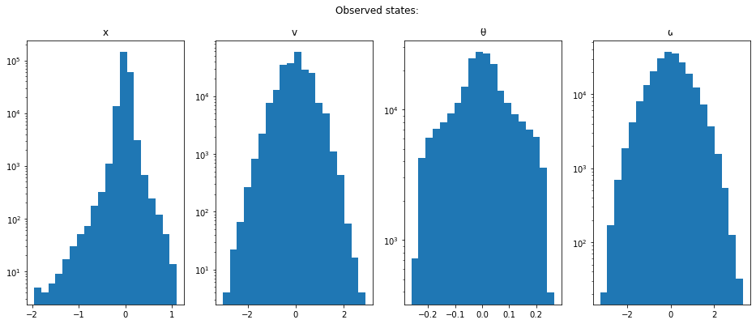
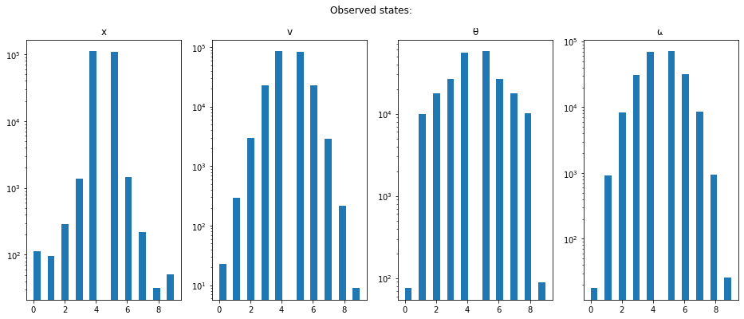
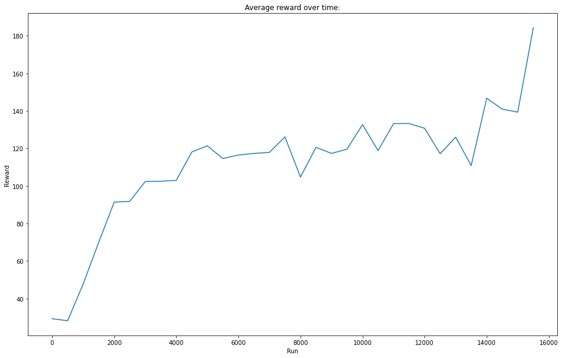
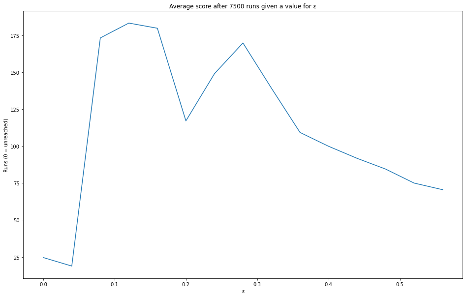
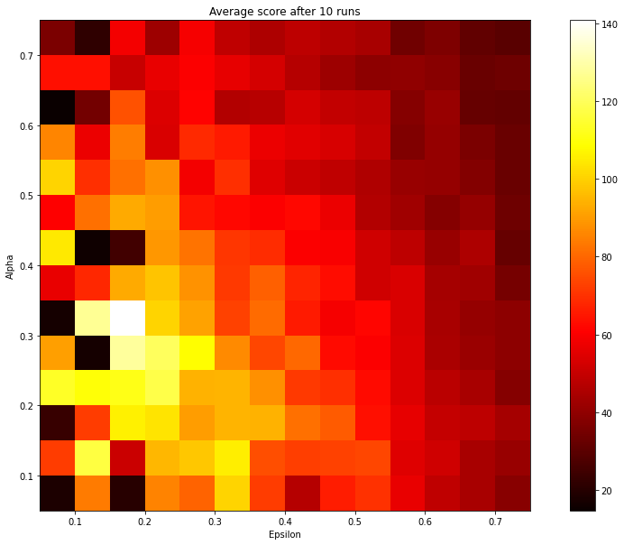

<!--
authors: Matthew Wilson, Daniele Reda
created: 2020/01/14
last_updated: 2020/01/27
-->


## CPSC 533V: Assignment 3 - Tabular Q Learning using OpenAI Gym environments

---

##  Tabular Q-Learning

Tabular Q-learning is an RL algorithm for problems with discrete states and discrete actions. The algorithm is described in the class notes, which borrows the summary description from [Section 6.5](http://incompleteideas.net/book/RLbook2018.pdf#page=153) of Richard Sutton's RL book. In the tabular approach, the Q-value is represented as a lookup table. As discussed in class, Q-learning can further be extended to continuous states and discrete actions, leading to the [Atari DQN](https://arxiv.org/abs/1312.5602) / Deep Q-learning algorithm.  However, it is important and informative to first fully understand tabular Q-learning.

Informally, Q-learning works as follows: The goal is to the perfectly learn the optimal Q-function: 
`Q(s,a)`, which is the *value* of being at state `s` and taking action `a`.  Q tells you how well you expect to do, on average, from here on out, given that you act optimally.  Once the Q function is learned, choosing an optimal action is as simple as looping over all possible actions and choosing the one with the highest Q (optimal action $a^* = \text{max}_a Q(s,a)$).  To learn Q, we initialize it arbitrarily and then iteratively refine it using the Bellman backup equation for Q functions, namely: 
$Q(s,a) \leftarrow Q(s,a) + \alpha [r + \gamma \text{max}_a Q(s', a) - Q(s,a)]$.
Here, $r$ is the reward associated with with the transition from state s to s', and $\alpha$ is a learning rate.

In this assignment you will implement tabular Q-learning and apply it to CartPole -- an environment with a **continuous** state space.  To apply the tabular method, you will need to discretize the CartPole state space by dividing the state-space into bins.


**Assignment goals:**
- to become familiar with python/numpy, as well as using an OpenAI Gym environment
- to understand tabular Q-learning, by implementing tabular Q-Learning for 
  a discretized version of a continuous-state environment, and experimenting with the implementation
- (optional) to develop further intuition regarding possible variations of the algorithm

## Introduction
Deep reinforcement learning has generated impressive results for board games ([Go][go], [Chess/Shogi][chess]), video games ([Atari][atari], , [DOTA2][dota], [StarCraft II][scii]), [and][baoding] [robotic][rubix] [control][anymal] ([of][cassie] [course][mimic] ;)).  RL is beginning to work for an increasing range of tasks and capabilities.  At the same time, there are many [gaping holes][irpan] and [difficulties][amid] in applying these methods. Understanding deep RL is important if you wish to have a good grasp of the modern landscape of control methods.

These next several assignments are designed to get you started with deep reinforcement learning, to give you a more close and personal understanding of the methods, and to provide you with a good starting point from which you can branch out into topics of interest. You will implement basic versions of some of the important fundamental algorithms in this space, including Q-learning and policy gradient/search methods.

We will only have time to cover a subset of methods and ideas in this space.
If you want to dig deeper, we suggest following the links given on the course webpage.  Additionally we draw special attention to the [Sutton book](http://incompleteideas.net/book/RLbook2018.pdf) for RL fundamentals and in depth coverage, and OpenAI's [Spinning Up resources](https://spinningup.openai.com/en/latest/spinningup/rl_intro.html) for a concise intro to RL and deep RL concepts, as well as good comparisons and implementations of modern deep RL algorithms.


[atari]: https://arxiv.org/abs/1312.5602
[go]: https://deepmind.com/research/case-studies/alphago-the-story-so-far
[chess]:https://deepmind.com/blog/article/alphazero-shedding-new-light-grand-games-chess-shogi-and-go 
[dota]: https://openai.com/blog/openai-five/
[scii]: https://deepmind.com/blog/article/AlphaStar-Grandmaster-level-in-StarCraft-II-using-multi-agent-reinforcement-learning
[baoding]: https://bair.berkeley.edu/blog/2019/09/30/deep-dynamics/
[rubix]: https://openai.com/blog/solving-rubiks-cube/
[cassie]: https://www.cs.ubc.ca/~van/papers/2019-CORL-cassie/index.html
[mimic]: https://www.cs.ubc.ca/~van/papers/2018-TOG-deepMimic/index.html
[anymal]: https://arxiv.org/abs/1901.08652


[irpan]: https://www.alexirpan.com/2018/02/14/rl-hard.html
[amid]: http://amid.fish/reproducing-deep-rl


```python
import time
import itertools
import numpy as np
import gym

from tqdm.notebook import tqdm as progress
import matplotlib.pyplot as plt
```

Two more added minor stylistic cells, turns off notebook scrolling and makes large figures by default:


```javascript
%%javascript
IPython.OutputArea.auto_scroll_threshold = 9999;
```


    <IPython.core.display.Javascript object>


```python
plt.rcParams['figure.figsize'] = [16, 10]
```

---

## 1. Explore the CartPole environment [18 pts]

Your first task is to familiarize yourself with the OpenAI gym interface and the [CartPole environment]( https://github.com/openai/gym/blob/master/gym/envs/classic_control/cartpole.py)
by writing a simple hand-coded policy to try to solve it.  
To begin understanding OpenAI Gym environments, [read this first](https://gym.openai.com/docs/).) 
The gym interface is very popular and you will see many algorithm implementations and 
custom environments that support it.  You may even want to use the API in your course projects, 
to define a custom environment for a task you want to solve.

Below is some example code that runs a simple random policy.  You are to:
- **run the code to see what it does**
- **write code that chooses an action based on the observation**.  You will need to learn about the gym API and to read the CartPole documentation to figure out what the `action` and `obs` vectors mean for this environment. 
Your hand-coded policy can be arbitrary, and it should ideally do better than the random policy.  There is no single correct answer. The goal is to become familiar with `env`s.
- **write code to print out the total reward gained by your policy in a single episode run**
- **answer the short-response questions below** (see the TODOs for all of this)


```python
env = gym.make('CartPole-v1')  # you can also try LunarLander-v2, but make sure to change it back
print('observation space:', env.observation_space)
print('action space:', env.action_space)

# To find out what the observations mean, read the CartPole documentation.
# Uncomment the lines below, or visit the source file: 
# https://github.com/openai/gym/blob/master/gym/envs/classic_control/cartpole.py

cartpole = env.unwrapped
# cartpole?
```

    C:\Users\Haaslab\Miniconda3\envs\pynt\lib\site-packages\gym\logger.py:30: UserWarning: WARN: Box bound precision lowered by casting to float32
      warnings.warn(colorize('%s: %s'%('WARN', msg % args), 'yellow'))
    

    observation space: Box(4,)
    action space: Discrete(2)
    


```python
# 1.1 [10pts]

# Random action:
def randomPick(env, state):
    return env.action_space.sample() # random action

# Go left if pole is tilting left, otherwise go right:
def simplePick(env, state):
    theta = state[2]
    return 0 if theta < 0 else 1

# Single run using a policy, return the reward
def runOnce(policyFunc, drawTime=None, updateFunc=None):
    obs = env.reset()
    rewardSum, done = 0, False
    
    # Keep going until the simulation is over:
    while not done:
        lastObs = obs
        action = policyFunc(env, obs)
        obs, reward, done, info = env.step(action)
        rewardSum += reward
        
        # Used later for Q-learning
        if updateFunc is not None:
            updateFunc(lastObs, action, reward, obs)

        if drawTime is not None:
            env.render()
            time.sleep(drawTime)
            
    return rewardSum

# Average reward for a policy, by running multiple times
def getAverageReward(policyFunc, nRuns, drawTime=None, updateFunc=None):
    if drawTime is not None:
        assert nRuns < 50 # Takes too long...
        
    allRewards = np.zeros(nRuns)
    for i in progress(range(nRuns), leave=False):
        allRewards[i] = runOnce(policyFunc, drawTime, updateFunc)
    # env.close()
    return np.mean(allRewards)

# Find average rewards for random and simple policies:
print ("Random pick, av reward: %.4f" % getAverageReward(randomPick, nRuns=1000))
print ("Simple pick, av reward: %.4f" % getAverageReward(simplePick, nRuns=1000))
```


    HBox(children=(IntProgress(value=0, max=1000), HTML(value='')))


    Random pick, av reward: 22.1480
    


    HBox(children=(IntProgress(value=0, max=1000), HTML(value='')))


    Simple pick, av reward: 41.8960
    

To answer the questions below, look at the full [source code here](https://github.com/openai/gym/blob/master/gym/envs/classic_control/cartpole.py) if you haven't already.


**1.2. [2pts] Describe the observation and action spaces of CartPole.  What do each of the values mean/do?**

The overservation space has four dimensions:

1. Position (x) of the cart
1. Velocity (v) = dx/dt
1. Angle of the pole (θ), in radians from upright
1. Angular velocity of the pole (ω) = dθ/dt

The action space is a discrete space with two options (i.e. equivalent to boolean):  
either applying a force leftwards or rightwards to the cart. Applying no force is not an option.

**1.3. [2pts] What distribution is used to sample initial states? (see the `reset` function)** 

All four values are picked at random, uniformly from -0.05 to 0.05

**1.4. [2pts] What is the termination condition, which determines if the `env` is `done`?** 

Either the cart has moved too far ($|x| > 2.4$) or the pole has dipped too far ($|\theta| > 12^o$), or if neither, then stops after 200 steps.

**1.5. [2pts] Briefly describe your policy.  What observation information does it use?  What score did you achieve (rough maximum and average)?  And how does it compare to the random policy?**

My policy: If the pole is tilting left ($\theta < 0), then move left, otherwise move right.
On average it scores ~42, rather than ~22 for the random policy

---

## 2. Discretize the env [32 pts]

Next, we need to discretize CartPole's continuous state space to work for tabular Q-learning.  While this is in part  a contrived usage of tabular methods, given the existence of other approaches that are designed to cope with continuous state-spaces, it is also interesting to consider whether tabular methods can be adapted more directly via discretization of the state into bins. Furthermore, tabular methods are simple, interpretabile, and can be proved to converge, and thus they still remain relevant.

Your task is to discretize the state/observation space so that it is compatible with tabular Q-learning.  To do this:
- **implement `obs_normalizer` to pass its test**
- **implement `get_bins` to pass its test**
- **then answer question 2.3**

[map]: https://arxiv.org/abs/1504.04909
[qd]: https://quality-diversity.github.io/

### Distribution of observed states
To assist in discretization, we can first apply random walks through the states and plot how often we end up observing each state dimension values.


```python
# Given a history of observed states, plot historgrams for what values were observed along each dimension
def _viewStatesHist(obsStates, nBins):
    f, axes = plt.subplots(1, 4, figsize=(16, 6))
    f.suptitle("Observed states:")
    for i, (ax, title) in enumerate(zip(axes, ["x", "v", "θ", "ω"])):
        ax.hist(obsStates[:, i], log=True, bins=nBins)
        ax.set_title(title)
    plt.show()
    # Also print min & max values, to calculate ranges:
    print ("Mins: ", np.min(obsStates, axis=0))
    print ("Maxs: ", np.max(obsStates, axis=0))

def viewVisitedStates(nRuns):
    _visitedStates = []
    def collectStates(s_old, a, r, s_new):
        _visitedStates.append(s_new)
    
    getAverageReward(randomPick, nRuns, updateFunc=collectStates)
    _viewStatesHist(np.array(_visitedStates), nBins=20)
    
viewVisitedStates(10000)
```


    HBox(children=(IntProgress(value=0, max=10000), HTML(value='')))


    





    Mins:  [-1.96317684 -3.03328444 -0.26226744 -3.26849353]
    Maxs:  [1.11189671 2.89930537 0.26734331 3.33472548]
    


```python
# Limits to the values accepted, anything outside is put to the outer bin.
# See above for calculations
LIMITS = (1.1, 2.5, 0.25, 3)

# Optional non-linear transform, should be odd (i.e. f(x) = -f(-x), f(0) = 0)
def xTransform(x):
    return x
    #return 1 / (1 + np.exp(-x))
    #return np.cbrt(np.cbrt(x))

def normToRange(v, limit):
    if v <= -limit:
        return 0
    if v >= limit:
        return 1

    # Want: 
    # -limit -> 0
    #   0    -> 0.5
    # limit  -> 1
    limTrans = xTransform(limit)
    vTrans = xTransform(v)
    assert np.abs(vTrans) <= np.abs(limTrans)
    vTrans /= limTrans # -1 <= vTrans <= 1
    return (vTrans + 1) / 2 # 0 <= return <= 1
    
# 2.1 [15pts for passing test_normed]
def obs_normalizer(obs):
    """Normalize the observations between 0 and 1
    
    If the observation has extremely large bounds, then clip to a reasonable range before normalizing; 
    (-2,2) should work.  (It is ok if the solution is specific to CartPole)
    
    Args:
        obs (np.ndarray): shape (4,) containing an observation from CartPole using the bound of the env
    Returns:
        normed (np.ndarray): shape (4,) where all elements are roughly uniformly mapped to the range [0, 1]
    
    """
    normed = np.zeros(obs.shape)
    for i in range(len(obs)):
        normed[i] = normToRange(obs[i], LIMITS[i])
    return normed
```


```python
### TEST 2.1
def test_normed():
    obs = env.reset()
    while True:
        obs, _, done, _ =  env.step(env.action_space.sample())
        normed = obs_normalizer(obs) 
        assert np.all(normed >= 0.0) and np.all(normed <= 1.0), '{} are outside of (0,1)'.format(normed)
        if done: break
    env.close()
    print('Passed!')
test_normed()
```

    Passed!
    


```python
# 2.2 [15pts for passing test_binned]
def get_bins(normed, num_bins):
    """Map normalized observations (0,1) to bin index values (0,num_bins-1)
    
    Args:
        normed (np.ndarray): shape (4,) output from obs_normalizer
        num_bins (int): how many bins to use
    Returns:
        binned (np.ndarray): shape (4,) where all elements are values in range [0,num_bins-1]
    
    """
    bins = np.zeros(normed.shape)
    
    # normToRange assumes that the outermost bins will correspond to 0 and 1 respectively
    bins[normed == 0] = 0
    bins[normed == 1] = num_bins-1
    
    # For everything else, map (0, 1) => [1, num_bins - 2] uniformly
    other = (0 < normed) & (normed < 1)
    bins[other] = np.floor(normed[other] * (num_bins - 2)) + 1
    return bins.astype(int) # These are indexes, to force integers
```


```python
### TEST 2.2
obs = env.reset()
env.close()

def test_binned(num_bins):
    normed = np.array([0.0, 0.2, 0.8, 1.0])
    binned = get_bins(normed, num_bins)
    assert np.all(binned >= 0) and np.all(binned < num_bins), '{} supposed to be between (0, {})'.format(binned, num_bins-1)
    
test_binned(5)
test_binned(10)
test_binned(50)
print('Passed!')
```

    Passed!
    


```python
## Finally, check that the binning still visits all bins too:
def _viewBinsHist(obsBins, nBins):
    f, axes = plt.subplots(1, 4, figsize=(16, 6))
    f.suptitle("Observed bins:")
    for i, (ax, title) in enumerate(zip(axes, ["x", "v", "θ", "ω"])):
        ax.hist(obsBins[:, i], log=True, bins=nBins)
        ax.set_title(title)
    plt.show()    
    print ("Mins: ", np.min(obsBins, axis=0))
    print ("Maxs: ", np.max(obsBins, axis=0))

def viewVisitedBins(nRuns, nBins):
    _visitedBins = []
    def collectStates(s_old, a, r, s_new):
        bins = get_bins(obs_normalizer(s_new), nBins)
        _visitedBins.append(bins)
    
    getAverageReward(randomPick, nRuns, updateFunc=collectStates)
    _viewStatesHist(np.array(_visitedBins), nBins=2*nBins)
    
viewVisitedBins(10000, nBins=10)
```


    HBox(children=(IntProgress(value=0, max=10000), HTML(value='')))


    





    Mins:  [0 0 0 0]
    Maxs:  [9 9 9 9]
    

**2.3. [2 pts] If your state has 4 values and each is binned into N possible bins, how many bins are needed to represent all unique possible states)?**  (yes, this is an easy question)


Assuming the 'number of bins' means the size of the state space, in this case we require:

$N * N * N * N = N^4$

---

## 3. Solve the env [30pts] 

Using the pseudocode below and the functions you implemented above, implement tabular Q-learning and use it to solve CartPole.

We provide setup code to initialize the Q-table and give examples of interfacing with it. Write the inner and outer loops to train your algorithm.  These training loops will be similar to those deep RL approaches, so get used to writing them!

The algorithm (excerpted from Section 6.5 of [Sutton's book](http://incompleteideas.net/book/RLbook2018.pdf)) is given below:


in summary:
- **implement Q-learning using this pseudocode and the helper code**
- **answer the questions below**
- **run the suggested experiments and otherwise experiment with whatever interests you**


```python
# 3.1 [30 pts]

# TODO: implement Q learning, following the pseudo-code above. 
#     - you can follow it almost exactly, but translating things for the gym api and our code used above
#     - make sure to use e-greedy, where e = random about 0.05 percent of the time
#     - make sure to do the S <-- S' step because it can be easy to forget
#     - every log_n steps, you should render your environment and
#       print out the average total episode rewards of the past log_n runs to monitor how your agent trains
#      (your implementation should be able to break at least +150 average reward value, and you can use that 
#       as a breaking condition.  It make take several minutes to run depending on your computer.)

# NOTE: the setup that was originally here mostly got moved to parameters that can be played with.

# Convert (S, A) to a tuple for indexing into Q
def saTuple(s, a):
    return tuple(s) + (a,)

# Initialize Q pulling uniformly from [0, 0.2], and setting boundary to 0.
def buildQ(num_bins):
    qShape = [num_bins]*len(obs)+[env.action_space.n]
    Q = np.random.uniform(low=0, high=0.2, size=qShape)
    # Boundary bins:
    Q[ 0,  :,  :,  :, 0] = 0
    Q[ 0,  :,  :,  :, 1] = 0
    Q[-1,  :,  :,  :, 0] = 0
    Q[-1,  :,  :,  :, 1] = 0
    Q[ :,  0,  :,  :, 0] = 0
    Q[ :,  0,  :,  :, 1] = 0
    Q[ :, -1,  :,  :, 0] = 0
    Q[ :, -1,  :,  :, 1] = 0
    Q[ :,  :,  0,  :, 0] = 0
    Q[ :,  :,  0,  :, 1] = 0
    Q[ :,  :, -1,  :, 0] = 0
    Q[ :,  :, -1,  :, 1] = 0
    Q[ :,  :,  :,  0, 0] = 0
    Q[ :,  :,  :,  0, 1] = 0
    Q[ :,  :,  :, -1, 0] = 0
    Q[ :,  :,  :, -1, 1] = 0
    return Q

# Return reward history, final Q function, and number of runs from a Q learning algorithm until it reaches a certain score.
def getAverageQReward(num_bins=10, alpha=0.1, gamma=0.99, eps=0.05, log_n=500, initQ=None, stopAtScore=None, maxRuns=10000, verbose=True):
    """
    Args:
        num_bins: Number of bins to discretize the state to
        alpha: learning rate, [0, 1]
        gamma: temporal discounting scale
        log_n: how often to display the environment and log scores
        eps: how often to move randomly (vs greedily)
        nRuns: how many runs to make
        initQ: initial Q values, if provided
        
    """
    # set eps to None for purely greedy
    Q = initQ if initQ is not None else buildQ(num_bins)
    obs2bin = lambda obs: tuple(get_bins(obs_normalizer(obs), num_bins=num_bins))
    
    # action = optimal if np.random.rand() > eps else random
    def epsGreedyPickFunc(env, lastObs):
        # random pick:
        if eps is not None and np.random.random() <= eps:
            return randomPick(env, lastObs)
        # otherwise, best:
        else:
            bins = obs2bin(lastObs)
            q0 = Q[saTuple(bins, 0)]
            q1 = Q[saTuple(bins, 1)]
            return 0 if q0 >= q1 else 1

    # Update Q
    def qUpdate(s_old, a, r, s_new):
        b_old, b_new = obs2bin(s_old), obs2bin(s_new)
        t_old = saTuple(b_old, a)

        maxQnew = max(Q[saTuple(b_new, 0)], Q[saTuple(b_new, 1)])
        Q[t_old] += alpha * (r + gamma * maxQnew - Q[t_old])        

    # Keep going until we reach a target score, logging every so often for progress
    avLastReward, atRun = 0, 0
    lastRewardHist = []
    while avLastReward < stopAtScore and atRun < maxRuns:
        avLastReward = getAverageReward(epsGreedyPickFunc, nRuns=log_n, updateFunc=qUpdate)
        lastRewardHist.append(avLastReward)
        if verbose:
            print ("Av reward, runs %d to %d: %.2f" % (atRun, atRun + log_n - 1, avLastReward))
        atRun += log_n
        
    return lastRewardHist, Q, atRun
```


```python
def qLearnUntil150():
    LOG_N, STOP_SCORE = 500, 150
    rewardHistory, _, runCount = getAverageQReward(log_n=LOG_N, stopAtScore=STOP_SCORE, maxRuns=100000)
    print ("Average score of %.2f achieved after %d runs" % (rewardHistory[-1], runCount))

    f, ax = plt.subplots(1, 1)
    ax.plot(np.arange(len(rewardHistory)) * LOG_N, rewardHistory)
    ax.set_title("Average reward over time:")
    ax.set_xlabel("Run")
    ax.set_ylabel("Reward")
    plt.show()

qLearnUntil150()
```


    HBox(children=(IntProgress(value=0, max=500), HTML(value='')))


    Av reward, runs 0 to 499: 29.25
    


    HBox(children=(IntProgress(value=0, max=500), HTML(value='')))


    Av reward, runs 500 to 999: 28.18
    


    HBox(children=(IntProgress(value=0, max=500), HTML(value='')))


    Av reward, runs 1000 to 1499: 47.71
    


    HBox(children=(IntProgress(value=0, max=500), HTML(value='')))


    Av reward, runs 1500 to 1999: 69.86
    


    HBox(children=(IntProgress(value=0, max=500), HTML(value='')))


    Av reward, runs 2000 to 2499: 91.38
    


    HBox(children=(IntProgress(value=0, max=500), HTML(value='')))


    Av reward, runs 2500 to 2999: 91.75
    


    HBox(children=(IntProgress(value=0, max=500), HTML(value='')))


    Av reward, runs 3000 to 3499: 102.36
    


    HBox(children=(IntProgress(value=0, max=500), HTML(value='')))


    Av reward, runs 3500 to 3999: 102.51
    


    HBox(children=(IntProgress(value=0, max=500), HTML(value='')))


    Av reward, runs 4000 to 4499: 102.96
    


    HBox(children=(IntProgress(value=0, max=500), HTML(value='')))


    Av reward, runs 4500 to 4999: 118.09
    


    HBox(children=(IntProgress(value=0, max=500), HTML(value='')))


    Av reward, runs 5000 to 5499: 121.38
    


    HBox(children=(IntProgress(value=0, max=500), HTML(value='')))


    Av reward, runs 5500 to 5999: 114.59
    


    HBox(children=(IntProgress(value=0, max=500), HTML(value='')))


    Av reward, runs 6000 to 6499: 116.47
    


    HBox(children=(IntProgress(value=0, max=500), HTML(value='')))


    Av reward, runs 6500 to 6999: 117.32
    


    HBox(children=(IntProgress(value=0, max=500), HTML(value='')))


    Av reward, runs 7000 to 7499: 117.86
    


    HBox(children=(IntProgress(value=0, max=500), HTML(value='')))


    Av reward, runs 7500 to 7999: 126.15
    


    HBox(children=(IntProgress(value=0, max=500), HTML(value='')))


    Av reward, runs 8000 to 8499: 104.73
    


    HBox(children=(IntProgress(value=0, max=500), HTML(value='')))


    Av reward, runs 8500 to 8999: 120.55
    


    HBox(children=(IntProgress(value=0, max=500), HTML(value='')))


    Av reward, runs 9000 to 9499: 117.34
    


    HBox(children=(IntProgress(value=0, max=500), HTML(value='')))


    Av reward, runs 9500 to 9999: 119.60
    


    HBox(children=(IntProgress(value=0, max=500), HTML(value='')))


    Av reward, runs 10000 to 10499: 132.69
    


    HBox(children=(IntProgress(value=0, max=500), HTML(value='')))


    Av reward, runs 10500 to 10999: 118.83
    


    HBox(children=(IntProgress(value=0, max=500), HTML(value='')))


    Av reward, runs 11000 to 11499: 133.22
    


    HBox(children=(IntProgress(value=0, max=500), HTML(value='')))


    Av reward, runs 11500 to 11999: 133.25
    


    HBox(children=(IntProgress(value=0, max=500), HTML(value='')))


    Av reward, runs 12000 to 12499: 130.74
    


    HBox(children=(IntProgress(value=0, max=500), HTML(value='')))


    Av reward, runs 12500 to 12999: 117.14
    


    HBox(children=(IntProgress(value=0, max=500), HTML(value='')))


    Av reward, runs 13000 to 13499: 125.99
    


    HBox(children=(IntProgress(value=0, max=500), HTML(value='')))


    Av reward, runs 13500 to 13999: 110.88
    


    HBox(children=(IntProgress(value=0, max=500), HTML(value='')))


    Av reward, runs 14000 to 14499: 146.77
    


    HBox(children=(IntProgress(value=0, max=500), HTML(value='')))


    Av reward, runs 14500 to 14999: 140.93
    


    HBox(children=(IntProgress(value=0, max=500), HTML(value='')))


    Av reward, runs 15000 to 15499: 139.34
    


    HBox(children=(IntProgress(value=0, max=500), HTML(value='')))


    Av reward, runs 15500 to 15999: 184.26
    Average score of 184.26 achieved after 16000 runs
    





## 4. Experiments [20 pts]

Given a working algorithm, you will run a few experiments.  Either make a copy of your code above to modify, or make the modifications in a way that they can be commented out or switched between (with boolean flag if statements).

**4.2. [10pts] $\epsilon$-greedy.**  How sensitive are the results to the value of $\epsilon$?   First, write down your prediction of what would happen if $\epsilon$ is set to various values, including for example [0, 0.05, 0.25, 0.5].


For ε = 0, the algorithm will always be greedy and chose the best option, but be unable to learn due to never exploring the environment, so its average reward will remain low and heavily dependent on the initial Q values.

As ε increases to a small value (e.g. 0.1), the algorithm will explore more and more, improving in learning speed as it keeps usually taking good actions, but also explores neighboring states to learn better choices.

As ε continues to increase however to larger values (e.g. 0.4), the algorithm will explore a lot of the state space, but its actions will be more random, so utilization of the Q values to actually reach ideal performance will diminish. 

Finally, as ε gets high enough (e.g. > 0.7), the algorithm will be too random, and again it will not achieve good rewards.


_Now run the experiment and observe the impact on the algorithm.  Report the results below._


```python
def plotRunCountForEpsilon():
    LOG_N, STOP_SCORE, MAX_RUNS = 500, 100000, 7500 # STOP_SCORE way too high, to force 8k runs

    epsValues = np.arange(0, 0.6, step=0.04)
    avScores = []

    for epsValue in progress(epsValues):
        rewardHist, _, _ = getAverageQReward(
            eps=epsValue,
            log_n=LOG_N, stopAtScore=STOP_SCORE, maxRuns=MAX_RUNS, verbose=False
        )
        avScores.append(rewardHist[-1])

    f, ax = plt.subplots(1, 1)
    ax.plot(epsValues, avScores)
    ax.set_title("Average score after %d runs given a value for ε" % MAX_RUNS)
    ax.set_xlabel("ε")
    ax.set_ylabel("Runs (0 = unreached)")
    plt.show()
    
plotRunCountForEpsilon()    
```


    HBox(children=(IntProgress(value=0, max=15), HTML(value='')))


    HBox(children=(IntProgress(value=0, max=500), HTML(value='')))


    HBox(children=(IntProgress(value=0, max=500), HTML(value='')))


    HBox(children=(IntProgress(value=0, max=500), HTML(value='')))


    HBox(children=(IntProgress(value=0, max=500), HTML(value='')))


    HBox(children=(IntProgress(value=0, max=500), HTML(value='')))


    HBox(children=(IntProgress(value=0, max=500), HTML(value='')))


    HBox(children=(IntProgress(value=0, max=500), HTML(value='')))


    HBox(children=(IntProgress(value=0, max=500), HTML(value='')))


    HBox(children=(IntProgress(value=0, max=500), HTML(value='')))


    HBox(children=(IntProgress(value=0, max=500), HTML(value='')))


    HBox(children=(IntProgress(value=0, max=500), HTML(value='')))


    HBox(children=(IntProgress(value=0, max=500), HTML(value='')))


    HBox(children=(IntProgress(value=0, max=500), HTML(value='')))


    HBox(children=(IntProgress(value=0, max=500), HTML(value='')))


    HBox(children=(IntProgress(value=0, max=500), HTML(value='')))


    HBox(children=(IntProgress(value=0, max=500), HTML(value='')))


    HBox(children=(IntProgress(value=0, max=500), HTML(value='')))


    HBox(children=(IntProgress(value=0, max=500), HTML(value='')))


    HBox(children=(IntProgress(value=0, max=500), HTML(value='')))


    HBox(children=(IntProgress(value=0, max=500), HTML(value='')))


    HBox(children=(IntProgress(value=0, max=500), HTML(value='')))


    HBox(children=(IntProgress(value=0, max=500), HTML(value='')))


    HBox(children=(IntProgress(value=0, max=500), HTML(value='')))


    HBox(children=(IntProgress(value=0, max=500), HTML(value='')))


    HBox(children=(IntProgress(value=0, max=500), HTML(value='')))


    HBox(children=(IntProgress(value=0, max=500), HTML(value='')))


    HBox(children=(IntProgress(value=0, max=500), HTML(value='')))


    HBox(children=(IntProgress(value=0, max=500), HTML(value='')))


    HBox(children=(IntProgress(value=0, max=500), HTML(value='')))


    HBox(children=(IntProgress(value=0, max=500), HTML(value='')))


    HBox(children=(IntProgress(value=0, max=500), HTML(value='')))


    HBox(children=(IntProgress(value=0, max=500), HTML(value='')))


    HBox(children=(IntProgress(value=0, max=500), HTML(value='')))


    HBox(children=(IntProgress(value=0, max=500), HTML(value='')))


    HBox(children=(IntProgress(value=0, max=500), HTML(value='')))


    HBox(children=(IntProgress(value=0, max=500), HTML(value='')))


    HBox(children=(IntProgress(value=0, max=500), HTML(value='')))


    HBox(children=(IntProgress(value=0, max=500), HTML(value='')))


    HBox(children=(IntProgress(value=0, max=500), HTML(value='')))


    HBox(children=(IntProgress(value=0, max=500), HTML(value='')))


    HBox(children=(IntProgress(value=0, max=500), HTML(value='')))


    HBox(children=(IntProgress(value=0, max=500), HTML(value='')))


    HBox(children=(IntProgress(value=0, max=500), HTML(value='')))


    HBox(children=(IntProgress(value=0, max=500), HTML(value='')))


    HBox(children=(IntProgress(value=0, max=500), HTML(value='')))


    HBox(children=(IntProgress(value=0, max=500), HTML(value='')))


    HBox(children=(IntProgress(value=0, max=500), HTML(value='')))


    HBox(children=(IntProgress(value=0, max=500), HTML(value='')))


    HBox(children=(IntProgress(value=0, max=500), HTML(value='')))


    HBox(children=(IntProgress(value=0, max=500), HTML(value='')))


    HBox(children=(IntProgress(value=0, max=500), HTML(value='')))


    HBox(children=(IntProgress(value=0, max=500), HTML(value='')))


    HBox(children=(IntProgress(value=0, max=500), HTML(value='')))


    HBox(children=(IntProgress(value=0, max=500), HTML(value='')))


    HBox(children=(IntProgress(value=0, max=500), HTML(value='')))


    HBox(children=(IntProgress(value=0, max=500), HTML(value='')))


    HBox(children=(IntProgress(value=0, max=500), HTML(value='')))


    HBox(children=(IntProgress(value=0, max=500), HTML(value='')))


    HBox(children=(IntProgress(value=0, max=500), HTML(value='')))


    HBox(children=(IntProgress(value=0, max=500), HTML(value='')))


    HBox(children=(IntProgress(value=0, max=500), HTML(value='')))


    HBox(children=(IntProgress(value=0, max=500), HTML(value='')))


    HBox(children=(IntProgress(value=0, max=500), HTML(value='')))


    HBox(children=(IntProgress(value=0, max=500), HTML(value='')))


    HBox(children=(IntProgress(value=0, max=500), HTML(value='')))


    HBox(children=(IntProgress(value=0, max=500), HTML(value='')))


    HBox(children=(IntProgress(value=0, max=500), HTML(value='')))


    HBox(children=(IntProgress(value=0, max=500), HTML(value='')))


    HBox(children=(IntProgress(value=0, max=500), HTML(value='')))


    HBox(children=(IntProgress(value=0, max=500), HTML(value='')))


    HBox(children=(IntProgress(value=0, max=500), HTML(value='')))


    HBox(children=(IntProgress(value=0, max=500), HTML(value='')))


    HBox(children=(IntProgress(value=0, max=500), HTML(value='')))


    HBox(children=(IntProgress(value=0, max=500), HTML(value='')))


    HBox(children=(IntProgress(value=0, max=500), HTML(value='')))


    HBox(children=(IntProgress(value=0, max=500), HTML(value='')))


    HBox(children=(IntProgress(value=0, max=500), HTML(value='')))


    HBox(children=(IntProgress(value=0, max=500), HTML(value='')))


    HBox(children=(IntProgress(value=0, max=500), HTML(value='')))


    HBox(children=(IntProgress(value=0, max=500), HTML(value='')))


    HBox(children=(IntProgress(value=0, max=500), HTML(value='')))


    HBox(children=(IntProgress(value=0, max=500), HTML(value='')))


    HBox(children=(IntProgress(value=0, max=500), HTML(value='')))


    HBox(children=(IntProgress(value=0, max=500), HTML(value='')))


    HBox(children=(IntProgress(value=0, max=500), HTML(value='')))


    HBox(children=(IntProgress(value=0, max=500), HTML(value='')))


    HBox(children=(IntProgress(value=0, max=500), HTML(value='')))


    HBox(children=(IntProgress(value=0, max=500), HTML(value='')))


    HBox(children=(IntProgress(value=0, max=500), HTML(value='')))


    HBox(children=(IntProgress(value=0, max=500), HTML(value='')))


    HBox(children=(IntProgress(value=0, max=500), HTML(value='')))


    HBox(children=(IntProgress(value=0, max=500), HTML(value='')))


    HBox(children=(IntProgress(value=0, max=500), HTML(value='')))


    HBox(children=(IntProgress(value=0, max=500), HTML(value='')))


    HBox(children=(IntProgress(value=0, max=500), HTML(value='')))


    HBox(children=(IntProgress(value=0, max=500), HTML(value='')))


    HBox(children=(IntProgress(value=0, max=500), HTML(value='')))


    HBox(children=(IntProgress(value=0, max=500), HTML(value='')))


    HBox(children=(IntProgress(value=0, max=500), HTML(value='')))


    HBox(children=(IntProgress(value=0, max=500), HTML(value='')))


    HBox(children=(IntProgress(value=0, max=500), HTML(value='')))


    HBox(children=(IntProgress(value=0, max=500), HTML(value='')))


    HBox(children=(IntProgress(value=0, max=500), HTML(value='')))


    HBox(children=(IntProgress(value=0, max=500), HTML(value='')))


    HBox(children=(IntProgress(value=0, max=500), HTML(value='')))


    HBox(children=(IntProgress(value=0, max=500), HTML(value='')))


    HBox(children=(IntProgress(value=0, max=500), HTML(value='')))


    HBox(children=(IntProgress(value=0, max=500), HTML(value='')))


    HBox(children=(IntProgress(value=0, max=500), HTML(value='')))


    HBox(children=(IntProgress(value=0, max=500), HTML(value='')))


    HBox(children=(IntProgress(value=0, max=500), HTML(value='')))


    HBox(children=(IntProgress(value=0, max=500), HTML(value='')))


    HBox(children=(IntProgress(value=0, max=500), HTML(value='')))


    HBox(children=(IntProgress(value=0, max=500), HTML(value='')))


    HBox(children=(IntProgress(value=0, max=500), HTML(value='')))


    HBox(children=(IntProgress(value=0, max=500), HTML(value='')))


    HBox(children=(IntProgress(value=0, max=500), HTML(value='')))


    HBox(children=(IntProgress(value=0, max=500), HTML(value='')))


    HBox(children=(IntProgress(value=0, max=500), HTML(value='')))


    HBox(children=(IntProgress(value=0, max=500), HTML(value='')))


    HBox(children=(IntProgress(value=0, max=500), HTML(value='')))


    HBox(children=(IntProgress(value=0, max=500), HTML(value='')))


    HBox(children=(IntProgress(value=0, max=500), HTML(value='')))


    HBox(children=(IntProgress(value=0, max=500), HTML(value='')))


    HBox(children=(IntProgress(value=0, max=500), HTML(value='')))


    HBox(children=(IntProgress(value=0, max=500), HTML(value='')))


    HBox(children=(IntProgress(value=0, max=500), HTML(value='')))


    HBox(children=(IntProgress(value=0, max=500), HTML(value='')))


    HBox(children=(IntProgress(value=0, max=500), HTML(value='')))


    HBox(children=(IntProgress(value=0, max=500), HTML(value='')))


    HBox(children=(IntProgress(value=0, max=500), HTML(value='')))


    HBox(children=(IntProgress(value=0, max=500), HTML(value='')))


    HBox(children=(IntProgress(value=0, max=500), HTML(value='')))


    HBox(children=(IntProgress(value=0, max=500), HTML(value='')))


    HBox(children=(IntProgress(value=0, max=500), HTML(value='')))


    HBox(children=(IntProgress(value=0, max=500), HTML(value='')))


    HBox(children=(IntProgress(value=0, max=500), HTML(value='')))


    HBox(children=(IntProgress(value=0, max=500), HTML(value='')))


    HBox(children=(IntProgress(value=0, max=500), HTML(value='')))


    HBox(children=(IntProgress(value=0, max=500), HTML(value='')))


    HBox(children=(IntProgress(value=0, max=500), HTML(value='')))


    HBox(children=(IntProgress(value=0, max=500), HTML(value='')))


    HBox(children=(IntProgress(value=0, max=500), HTML(value='')))


    HBox(children=(IntProgress(value=0, max=500), HTML(value='')))


    HBox(children=(IntProgress(value=0, max=500), HTML(value='')))


    HBox(children=(IntProgress(value=0, max=500), HTML(value='')))


    HBox(children=(IntProgress(value=0, max=500), HTML(value='')))


    HBox(children=(IntProgress(value=0, max=500), HTML(value='')))


    HBox(children=(IntProgress(value=0, max=500), HTML(value='')))


    HBox(children=(IntProgress(value=0, max=500), HTML(value='')))


    HBox(children=(IntProgress(value=0, max=500), HTML(value='')))


    HBox(children=(IntProgress(value=0, max=500), HTML(value='')))


    HBox(children=(IntProgress(value=0, max=500), HTML(value='')))


    HBox(children=(IntProgress(value=0, max=500), HTML(value='')))


    HBox(children=(IntProgress(value=0, max=500), HTML(value='')))


    HBox(children=(IntProgress(value=0, max=500), HTML(value='')))


    HBox(children=(IntProgress(value=0, max=500), HTML(value='')))


    HBox(children=(IntProgress(value=0, max=500), HTML(value='')))


    HBox(children=(IntProgress(value=0, max=500), HTML(value='')))


    HBox(children=(IntProgress(value=0, max=500), HTML(value='')))


    HBox(children=(IntProgress(value=0, max=500), HTML(value='')))


    HBox(children=(IntProgress(value=0, max=500), HTML(value='')))


    HBox(children=(IntProgress(value=0, max=500), HTML(value='')))


    HBox(children=(IntProgress(value=0, max=500), HTML(value='')))


    HBox(children=(IntProgress(value=0, max=500), HTML(value='')))


    HBox(children=(IntProgress(value=0, max=500), HTML(value='')))


    HBox(children=(IntProgress(value=0, max=500), HTML(value='')))


    HBox(children=(IntProgress(value=0, max=500), HTML(value='')))


    HBox(children=(IntProgress(value=0, max=500), HTML(value='')))


    HBox(children=(IntProgress(value=0, max=500), HTML(value='')))


    HBox(children=(IntProgress(value=0, max=500), HTML(value='')))


    HBox(children=(IntProgress(value=0, max=500), HTML(value='')))


    HBox(children=(IntProgress(value=0, max=500), HTML(value='')))


    HBox(children=(IntProgress(value=0, max=500), HTML(value='')))


    HBox(children=(IntProgress(value=0, max=500), HTML(value='')))


    HBox(children=(IntProgress(value=0, max=500), HTML(value='')))


    HBox(children=(IntProgress(value=0, max=500), HTML(value='')))


    HBox(children=(IntProgress(value=0, max=500), HTML(value='')))


    HBox(children=(IntProgress(value=0, max=500), HTML(value='')))


    HBox(children=(IntProgress(value=0, max=500), HTML(value='')))


    HBox(children=(IntProgress(value=0, max=500), HTML(value='')))


    HBox(children=(IntProgress(value=0, max=500), HTML(value='')))


    HBox(children=(IntProgress(value=0, max=500), HTML(value='')))


    HBox(children=(IntProgress(value=0, max=500), HTML(value='')))


    HBox(children=(IntProgress(value=0, max=500), HTML(value='')))


    HBox(children=(IntProgress(value=0, max=500), HTML(value='')))


    HBox(children=(IntProgress(value=0, max=500), HTML(value='')))


    HBox(children=(IntProgress(value=0, max=500), HTML(value='')))


    HBox(children=(IntProgress(value=0, max=500), HTML(value='')))


    HBox(children=(IntProgress(value=0, max=500), HTML(value='')))


    HBox(children=(IntProgress(value=0, max=500), HTML(value='')))


    HBox(children=(IntProgress(value=0, max=500), HTML(value='')))


    HBox(children=(IntProgress(value=0, max=500), HTML(value='')))


    HBox(children=(IntProgress(value=0, max=500), HTML(value='')))


    HBox(children=(IntProgress(value=0, max=500), HTML(value='')))


    HBox(children=(IntProgress(value=0, max=500), HTML(value='')))


    HBox(children=(IntProgress(value=0, max=500), HTML(value='')))


    HBox(children=(IntProgress(value=0, max=500), HTML(value='')))


    HBox(children=(IntProgress(value=0, max=500), HTML(value='')))


    HBox(children=(IntProgress(value=0, max=500), HTML(value='')))


    HBox(children=(IntProgress(value=0, max=500), HTML(value='')))


    HBox(children=(IntProgress(value=0, max=500), HTML(value='')))


    HBox(children=(IntProgress(value=0, max=500), HTML(value='')))


    HBox(children=(IntProgress(value=0, max=500), HTML(value='')))


    HBox(children=(IntProgress(value=0, max=500), HTML(value='')))


    HBox(children=(IntProgress(value=0, max=500), HTML(value='')))


    HBox(children=(IntProgress(value=0, max=500), HTML(value='')))


    HBox(children=(IntProgress(value=0, max=500), HTML(value='')))


    HBox(children=(IntProgress(value=0, max=500), HTML(value='')))


    HBox(children=(IntProgress(value=0, max=500), HTML(value='')))


    HBox(children=(IntProgress(value=0, max=500), HTML(value='')))


    HBox(children=(IntProgress(value=0, max=500), HTML(value='')))


    HBox(children=(IntProgress(value=0, max=500), HTML(value='')))


    HBox(children=(IntProgress(value=0, max=500), HTML(value='')))


    HBox(children=(IntProgress(value=0, max=500), HTML(value='')))


    HBox(children=(IntProgress(value=0, max=500), HTML(value='')))


    HBox(children=(IntProgress(value=0, max=500), HTML(value='')))


    HBox(children=(IntProgress(value=0, max=500), HTML(value='')))


    HBox(children=(IntProgress(value=0, max=500), HTML(value='')))


    HBox(children=(IntProgress(value=0, max=500), HTML(value='')))


    HBox(children=(IntProgress(value=0, max=500), HTML(value='')))


    HBox(children=(IntProgress(value=0, max=500), HTML(value='')))


    HBox(children=(IntProgress(value=0, max=500), HTML(value='')))


    HBox(children=(IntProgress(value=0, max=500), HTML(value='')))


    HBox(children=(IntProgress(value=0, max=500), HTML(value='')))


    
    





**4.3. [10pts] Design your own experiment.** Design a modification that you think would either increase or reduce performance.  A simple example (which you can use) is initializing the Q-table differently, and thinking about how this might alter performance. Write down your idea, what you think might happen, and why.

A very simple modification is exploring behaviour for all **pairs** of epsilon and alpha.

Taking a similar approach, we now can iterate over multiple values of each, and see good its score can within a certain number of iterations (2000, to keep execution time under an hour).

As above, we expect similar results: α too low will not learn, as the algorithm won't update much beyond its initial values. α too high will become too random, as its Q will depend too much on what it just observed, so it will have trouble stabilizing.

These two can balance off eachother: lower α increases stability, so will result in the optimal ε being higher to counteract it with more randomization. Similarly, a higher α will have a lower optimal ε. The end result will be a curve of optimal values.

_Run the experiment and report the results._


```python
def plotRunCountForEpsilonAndAlpha():
    LOG_N, STOP_SCORE, MAX_RUNS = 200, 100000, 2000 # STOP_SCORE way too high, to force 2k runs
    
    alphaValues = np.arange(0.05, 0.75, step=0.05)
    epsValues = np.arange(0.05, 0.75, step=0.05)
    
    avScores = np.zeros((len(alphaValues), len(epsValues)))
    for i, alphaValue in enumerate(progress(alphaValues)):
        for j, epsValue in enumerate(progress(epsValues, leave=False)):
            rewardHist, _, _ = getAverageQReward(
                alpha=alphaValue, eps=epsValue,
                log_n=LOG_N, stopAtScore=STOP_SCORE, maxRuns=MAX_RUNS, verbose=False
            )
            avScores[i][j] = rewardHist[-1]
    
    f, ax = plt.subplots(1, 1)
    m = ax.imshow(avScores[::-1, :], cmap='hot', interpolation='none', extent=[0.05, 0.75, 0.05, 0.75])
    ax.set_title("Average score after %d runs" % (10))
    ax.set_xlabel("Epsilon")
    ax.set_ylabel("Alpha")
    f.colorbar(m)
    plt.show()

rc = plotRunCountForEpsilonAndAlpha()
```


    HBox(children=(IntProgress(value=0, max=14), HTML(value='')))


    HBox(children=(IntProgress(value=0, max=14), HTML(value='')))


    HBox(children=(IntProgress(value=0, max=200), HTML(value='')))


    HBox(children=(IntProgress(value=0, max=200), HTML(value='')))


    HBox(children=(IntProgress(value=0, max=200), HTML(value='')))


    HBox(children=(IntProgress(value=0, max=200), HTML(value='')))


    HBox(children=(IntProgress(value=0, max=200), HTML(value='')))


    HBox(children=(IntProgress(value=0, max=200), HTML(value='')))


    HBox(children=(IntProgress(value=0, max=200), HTML(value='')))


    HBox(children=(IntProgress(value=0, max=200), HTML(value='')))


    HBox(children=(IntProgress(value=0, max=200), HTML(value='')))


    HBox(children=(IntProgress(value=0, max=200), HTML(value='')))


    HBox(children=(IntProgress(value=0, max=200), HTML(value='')))


    HBox(children=(IntProgress(value=0, max=200), HTML(value='')))


    HBox(children=(IntProgress(value=0, max=200), HTML(value='')))


    HBox(children=(IntProgress(value=0, max=200), HTML(value='')))


    HBox(children=(IntProgress(value=0, max=200), HTML(value='')))


    HBox(children=(IntProgress(value=0, max=200), HTML(value='')))


    HBox(children=(IntProgress(value=0, max=200), HTML(value='')))


    HBox(children=(IntProgress(value=0, max=200), HTML(value='')))


    HBox(children=(IntProgress(value=0, max=200), HTML(value='')))


    HBox(children=(IntProgress(value=0, max=200), HTML(value='')))


    HBox(children=(IntProgress(value=0, max=200), HTML(value='')))


    HBox(children=(IntProgress(value=0, max=200), HTML(value='')))


    HBox(children=(IntProgress(value=0, max=200), HTML(value='')))


    HBox(children=(IntProgress(value=0, max=200), HTML(value='')))


    HBox(children=(IntProgress(value=0, max=200), HTML(value='')))


    HBox(children=(IntProgress(value=0, max=200), HTML(value='')))


    HBox(children=(IntProgress(value=0, max=200), HTML(value='')))


    HBox(children=(IntProgress(value=0, max=200), HTML(value='')))


    HBox(children=(IntProgress(value=0, max=200), HTML(value='')))


    HBox(children=(IntProgress(value=0, max=200), HTML(value='')))


    HBox(children=(IntProgress(value=0, max=200), HTML(value='')))


    HBox(children=(IntProgress(value=0, max=200), HTML(value='')))


    HBox(children=(IntProgress(value=0, max=200), HTML(value='')))


    HBox(children=(IntProgress(value=0, max=200), HTML(value='')))


    HBox(children=(IntProgress(value=0, max=200), HTML(value='')))


    HBox(children=(IntProgress(value=0, max=200), HTML(value='')))


    HBox(children=(IntProgress(value=0, max=200), HTML(value='')))


    HBox(children=(IntProgress(value=0, max=200), HTML(value='')))


    HBox(children=(IntProgress(value=0, max=200), HTML(value='')))


    HBox(children=(IntProgress(value=0, max=200), HTML(value='')))


    HBox(children=(IntProgress(value=0, max=200), HTML(value='')))


    HBox(children=(IntProgress(value=0, max=200), HTML(value='')))


    HBox(children=(IntProgress(value=0, max=200), HTML(value='')))


    HBox(children=(IntProgress(value=0, max=200), HTML(value='')))


    HBox(children=(IntProgress(value=0, max=200), HTML(value='')))


    HBox(children=(IntProgress(value=0, max=200), HTML(value='')))


    HBox(children=(IntProgress(value=0, max=200), HTML(value='')))


    HBox(children=(IntProgress(value=0, max=200), HTML(value='')))


    HBox(children=(IntProgress(value=0, max=200), HTML(value='')))


    HBox(children=(IntProgress(value=0, max=200), HTML(value='')))


    HBox(children=(IntProgress(value=0, max=200), HTML(value='')))


    HBox(children=(IntProgress(value=0, max=200), HTML(value='')))


    HBox(children=(IntProgress(value=0, max=200), HTML(value='')))


    HBox(children=(IntProgress(value=0, max=200), HTML(value='')))


    HBox(children=(IntProgress(value=0, max=200), HTML(value='')))


    HBox(children=(IntProgress(value=0, max=200), HTML(value='')))


    HBox(children=(IntProgress(value=0, max=200), HTML(value='')))


    HBox(children=(IntProgress(value=0, max=200), HTML(value='')))


    HBox(children=(IntProgress(value=0, max=200), HTML(value='')))


    HBox(children=(IntProgress(value=0, max=200), HTML(value='')))


    HBox(children=(IntProgress(value=0, max=200), HTML(value='')))


    HBox(children=(IntProgress(value=0, max=200), HTML(value='')))


    HBox(children=(IntProgress(value=0, max=200), HTML(value='')))


    HBox(children=(IntProgress(value=0, max=200), HTML(value='')))


    HBox(children=(IntProgress(value=0, max=200), HTML(value='')))


    HBox(children=(IntProgress(value=0, max=200), HTML(value='')))


    HBox(children=(IntProgress(value=0, max=200), HTML(value='')))


    HBox(children=(IntProgress(value=0, max=200), HTML(value='')))


    HBox(children=(IntProgress(value=0, max=200), HTML(value='')))


    HBox(children=(IntProgress(value=0, max=200), HTML(value='')))


    HBox(children=(IntProgress(value=0, max=200), HTML(value='')))


    HBox(children=(IntProgress(value=0, max=200), HTML(value='')))


    HBox(children=(IntProgress(value=0, max=200), HTML(value='')))


    HBox(children=(IntProgress(value=0, max=200), HTML(value='')))


    HBox(children=(IntProgress(value=0, max=200), HTML(value='')))


    HBox(children=(IntProgress(value=0, max=200), HTML(value='')))


    HBox(children=(IntProgress(value=0, max=200), HTML(value='')))


    HBox(children=(IntProgress(value=0, max=200), HTML(value='')))


    HBox(children=(IntProgress(value=0, max=200), HTML(value='')))


    HBox(children=(IntProgress(value=0, max=200), HTML(value='')))


    HBox(children=(IntProgress(value=0, max=200), HTML(value='')))


    HBox(children=(IntProgress(value=0, max=200), HTML(value='')))


    HBox(children=(IntProgress(value=0, max=200), HTML(value='')))


    HBox(children=(IntProgress(value=0, max=200), HTML(value='')))


    HBox(children=(IntProgress(value=0, max=200), HTML(value='')))


    HBox(children=(IntProgress(value=0, max=200), HTML(value='')))


    HBox(children=(IntProgress(value=0, max=200), HTML(value='')))


    HBox(children=(IntProgress(value=0, max=200), HTML(value='')))


    HBox(children=(IntProgress(value=0, max=200), HTML(value='')))


    HBox(children=(IntProgress(value=0, max=200), HTML(value='')))


    HBox(children=(IntProgress(value=0, max=200), HTML(value='')))


    HBox(children=(IntProgress(value=0, max=200), HTML(value='')))


    HBox(children=(IntProgress(value=0, max=200), HTML(value='')))


    HBox(children=(IntProgress(value=0, max=200), HTML(value='')))


    HBox(children=(IntProgress(value=0, max=200), HTML(value='')))


    HBox(children=(IntProgress(value=0, max=200), HTML(value='')))


    HBox(children=(IntProgress(value=0, max=200), HTML(value='')))


    HBox(children=(IntProgress(value=0, max=200), HTML(value='')))


    HBox(children=(IntProgress(value=0, max=200), HTML(value='')))


    HBox(children=(IntProgress(value=0, max=200), HTML(value='')))


    HBox(children=(IntProgress(value=0, max=200), HTML(value='')))


    HBox(children=(IntProgress(value=0, max=200), HTML(value='')))


    HBox(children=(IntProgress(value=0, max=200), HTML(value='')))


    HBox(children=(IntProgress(value=0, max=200), HTML(value='')))


    HBox(children=(IntProgress(value=0, max=200), HTML(value='')))


    HBox(children=(IntProgress(value=0, max=200), HTML(value='')))


    HBox(children=(IntProgress(value=0, max=200), HTML(value='')))


    HBox(children=(IntProgress(value=0, max=200), HTML(value='')))


    HBox(children=(IntProgress(value=0, max=200), HTML(value='')))


    HBox(children=(IntProgress(value=0, max=200), HTML(value='')))


    HBox(children=(IntProgress(value=0, max=200), HTML(value='')))


    HBox(children=(IntProgress(value=0, max=200), HTML(value='')))


    HBox(children=(IntProgress(value=0, max=200), HTML(value='')))


    HBox(children=(IntProgress(value=0, max=200), HTML(value='')))


    HBox(children=(IntProgress(value=0, max=200), HTML(value='')))


    HBox(children=(IntProgress(value=0, max=200), HTML(value='')))


    HBox(children=(IntProgress(value=0, max=200), HTML(value='')))


    HBox(children=(IntProgress(value=0, max=200), HTML(value='')))


    HBox(children=(IntProgress(value=0, max=200), HTML(value='')))


    HBox(children=(IntProgress(value=0, max=200), HTML(value='')))


    HBox(children=(IntProgress(value=0, max=200), HTML(value='')))


    HBox(children=(IntProgress(value=0, max=200), HTML(value='')))


    HBox(children=(IntProgress(value=0, max=200), HTML(value='')))


    HBox(children=(IntProgress(value=0, max=200), HTML(value='')))


    HBox(children=(IntProgress(value=0, max=200), HTML(value='')))


    HBox(children=(IntProgress(value=0, max=200), HTML(value='')))


    HBox(children=(IntProgress(value=0, max=200), HTML(value='')))


    HBox(children=(IntProgress(value=0, max=200), HTML(value='')))


    HBox(children=(IntProgress(value=0, max=200), HTML(value='')))


    HBox(children=(IntProgress(value=0, max=200), HTML(value='')))


    HBox(children=(IntProgress(value=0, max=200), HTML(value='')))


    HBox(children=(IntProgress(value=0, max=200), HTML(value='')))


    HBox(children=(IntProgress(value=0, max=200), HTML(value='')))


    HBox(children=(IntProgress(value=0, max=200), HTML(value='')))


    HBox(children=(IntProgress(value=0, max=200), HTML(value='')))


    HBox(children=(IntProgress(value=0, max=200), HTML(value='')))


    HBox(children=(IntProgress(value=0, max=200), HTML(value='')))


    HBox(children=(IntProgress(value=0, max=200), HTML(value='')))


    HBox(children=(IntProgress(value=0, max=200), HTML(value='')))


    HBox(children=(IntProgress(value=0, max=200), HTML(value='')))


    HBox(children=(IntProgress(value=0, max=14), HTML(value='')))


    HBox(children=(IntProgress(value=0, max=200), HTML(value='')))


    HBox(children=(IntProgress(value=0, max=200), HTML(value='')))


    HBox(children=(IntProgress(value=0, max=200), HTML(value='')))


    HBox(children=(IntProgress(value=0, max=200), HTML(value='')))


    HBox(children=(IntProgress(value=0, max=200), HTML(value='')))


    HBox(children=(IntProgress(value=0, max=200), HTML(value='')))


    HBox(children=(IntProgress(value=0, max=200), HTML(value='')))


    HBox(children=(IntProgress(value=0, max=200), HTML(value='')))


    HBox(children=(IntProgress(value=0, max=200), HTML(value='')))


    HBox(children=(IntProgress(value=0, max=200), HTML(value='')))


    HBox(children=(IntProgress(value=0, max=200), HTML(value='')))


    HBox(children=(IntProgress(value=0, max=200), HTML(value='')))


    HBox(children=(IntProgress(value=0, max=200), HTML(value='')))


    HBox(children=(IntProgress(value=0, max=200), HTML(value='')))


    HBox(children=(IntProgress(value=0, max=200), HTML(value='')))


    HBox(children=(IntProgress(value=0, max=200), HTML(value='')))


    HBox(children=(IntProgress(value=0, max=200), HTML(value='')))


    HBox(children=(IntProgress(value=0, max=200), HTML(value='')))


    HBox(children=(IntProgress(value=0, max=200), HTML(value='')))


    HBox(children=(IntProgress(value=0, max=200), HTML(value='')))


    HBox(children=(IntProgress(value=0, max=200), HTML(value='')))


    HBox(children=(IntProgress(value=0, max=200), HTML(value='')))


    HBox(children=(IntProgress(value=0, max=200), HTML(value='')))


    HBox(children=(IntProgress(value=0, max=200), HTML(value='')))


    HBox(children=(IntProgress(value=0, max=200), HTML(value='')))


    HBox(children=(IntProgress(value=0, max=200), HTML(value='')))


    HBox(children=(IntProgress(value=0, max=200), HTML(value='')))


    HBox(children=(IntProgress(value=0, max=200), HTML(value='')))


    HBox(children=(IntProgress(value=0, max=200), HTML(value='')))


    HBox(children=(IntProgress(value=0, max=200), HTML(value='')))


    HBox(children=(IntProgress(value=0, max=200), HTML(value='')))


    HBox(children=(IntProgress(value=0, max=200), HTML(value='')))


    HBox(children=(IntProgress(value=0, max=200), HTML(value='')))


    HBox(children=(IntProgress(value=0, max=200), HTML(value='')))


    HBox(children=(IntProgress(value=0, max=200), HTML(value='')))


    HBox(children=(IntProgress(value=0, max=200), HTML(value='')))


    HBox(children=(IntProgress(value=0, max=200), HTML(value='')))


    HBox(children=(IntProgress(value=0, max=200), HTML(value='')))


    HBox(children=(IntProgress(value=0, max=200), HTML(value='')))


    HBox(children=(IntProgress(value=0, max=200), HTML(value='')))


    HBox(children=(IntProgress(value=0, max=200), HTML(value='')))


    HBox(children=(IntProgress(value=0, max=200), HTML(value='')))


    HBox(children=(IntProgress(value=0, max=200), HTML(value='')))


    HBox(children=(IntProgress(value=0, max=200), HTML(value='')))


    HBox(children=(IntProgress(value=0, max=200), HTML(value='')))


    HBox(children=(IntProgress(value=0, max=200), HTML(value='')))


    HBox(children=(IntProgress(value=0, max=200), HTML(value='')))


    HBox(children=(IntProgress(value=0, max=200), HTML(value='')))


    HBox(children=(IntProgress(value=0, max=200), HTML(value='')))


    HBox(children=(IntProgress(value=0, max=200), HTML(value='')))


    HBox(children=(IntProgress(value=0, max=200), HTML(value='')))


    HBox(children=(IntProgress(value=0, max=200), HTML(value='')))


    HBox(children=(IntProgress(value=0, max=200), HTML(value='')))


    HBox(children=(IntProgress(value=0, max=200), HTML(value='')))


    HBox(children=(IntProgress(value=0, max=200), HTML(value='')))


    HBox(children=(IntProgress(value=0, max=200), HTML(value='')))


    HBox(children=(IntProgress(value=0, max=200), HTML(value='')))


    HBox(children=(IntProgress(value=0, max=200), HTML(value='')))


    HBox(children=(IntProgress(value=0, max=200), HTML(value='')))


    HBox(children=(IntProgress(value=0, max=200), HTML(value='')))


    HBox(children=(IntProgress(value=0, max=200), HTML(value='')))


    HBox(children=(IntProgress(value=0, max=200), HTML(value='')))


    HBox(children=(IntProgress(value=0, max=200), HTML(value='')))


    HBox(children=(IntProgress(value=0, max=200), HTML(value='')))


    HBox(children=(IntProgress(value=0, max=200), HTML(value='')))


    HBox(children=(IntProgress(value=0, max=200), HTML(value='')))


    HBox(children=(IntProgress(value=0, max=200), HTML(value='')))


    HBox(children=(IntProgress(value=0, max=200), HTML(value='')))


    HBox(children=(IntProgress(value=0, max=200), HTML(value='')))


    HBox(children=(IntProgress(value=0, max=200), HTML(value='')))


    HBox(children=(IntProgress(value=0, max=200), HTML(value='')))


    HBox(children=(IntProgress(value=0, max=200), HTML(value='')))


    HBox(children=(IntProgress(value=0, max=200), HTML(value='')))


    HBox(children=(IntProgress(value=0, max=200), HTML(value='')))


    HBox(children=(IntProgress(value=0, max=200), HTML(value='')))


    HBox(children=(IntProgress(value=0, max=200), HTML(value='')))


    HBox(children=(IntProgress(value=0, max=200), HTML(value='')))


    HBox(children=(IntProgress(value=0, max=200), HTML(value='')))


    HBox(children=(IntProgress(value=0, max=200), HTML(value='')))


    HBox(children=(IntProgress(value=0, max=200), HTML(value='')))


    HBox(children=(IntProgress(value=0, max=200), HTML(value='')))


    HBox(children=(IntProgress(value=0, max=200), HTML(value='')))


    HBox(children=(IntProgress(value=0, max=200), HTML(value='')))


    HBox(children=(IntProgress(value=0, max=200), HTML(value='')))


    HBox(children=(IntProgress(value=0, max=200), HTML(value='')))


    HBox(children=(IntProgress(value=0, max=200), HTML(value='')))


    HBox(children=(IntProgress(value=0, max=200), HTML(value='')))


    HBox(children=(IntProgress(value=0, max=200), HTML(value='')))


    HBox(children=(IntProgress(value=0, max=200), HTML(value='')))


    HBox(children=(IntProgress(value=0, max=200), HTML(value='')))


    HBox(children=(IntProgress(value=0, max=200), HTML(value='')))


    HBox(children=(IntProgress(value=0, max=200), HTML(value='')))


    HBox(children=(IntProgress(value=0, max=200), HTML(value='')))


    HBox(children=(IntProgress(value=0, max=200), HTML(value='')))


    HBox(children=(IntProgress(value=0, max=200), HTML(value='')))


    HBox(children=(IntProgress(value=0, max=200), HTML(value='')))


    HBox(children=(IntProgress(value=0, max=200), HTML(value='')))


    HBox(children=(IntProgress(value=0, max=200), HTML(value='')))


    HBox(children=(IntProgress(value=0, max=200), HTML(value='')))


    HBox(children=(IntProgress(value=0, max=200), HTML(value='')))


    HBox(children=(IntProgress(value=0, max=200), HTML(value='')))


    HBox(children=(IntProgress(value=0, max=200), HTML(value='')))


    HBox(children=(IntProgress(value=0, max=200), HTML(value='')))


    HBox(children=(IntProgress(value=0, max=200), HTML(value='')))


    HBox(children=(IntProgress(value=0, max=200), HTML(value='')))


    HBox(children=(IntProgress(value=0, max=200), HTML(value='')))


    HBox(children=(IntProgress(value=0, max=200), HTML(value='')))


    HBox(children=(IntProgress(value=0, max=200), HTML(value='')))


    HBox(children=(IntProgress(value=0, max=200), HTML(value='')))


    HBox(children=(IntProgress(value=0, max=200), HTML(value='')))


    HBox(children=(IntProgress(value=0, max=200), HTML(value='')))


    HBox(children=(IntProgress(value=0, max=200), HTML(value='')))


    HBox(children=(IntProgress(value=0, max=200), HTML(value='')))


    HBox(children=(IntProgress(value=0, max=200), HTML(value='')))


    HBox(children=(IntProgress(value=0, max=200), HTML(value='')))


    HBox(children=(IntProgress(value=0, max=200), HTML(value='')))


    HBox(children=(IntProgress(value=0, max=200), HTML(value='')))


    HBox(children=(IntProgress(value=0, max=200), HTML(value='')))


    HBox(children=(IntProgress(value=0, max=200), HTML(value='')))


    HBox(children=(IntProgress(value=0, max=200), HTML(value='')))


    HBox(children=(IntProgress(value=0, max=200), HTML(value='')))


    HBox(children=(IntProgress(value=0, max=200), HTML(value='')))


    HBox(children=(IntProgress(value=0, max=200), HTML(value='')))


    HBox(children=(IntProgress(value=0, max=200), HTML(value='')))


    HBox(children=(IntProgress(value=0, max=200), HTML(value='')))


    HBox(children=(IntProgress(value=0, max=200), HTML(value='')))


    HBox(children=(IntProgress(value=0, max=200), HTML(value='')))


    HBox(children=(IntProgress(value=0, max=200), HTML(value='')))


    HBox(children=(IntProgress(value=0, max=200), HTML(value='')))


    HBox(children=(IntProgress(value=0, max=200), HTML(value='')))


    HBox(children=(IntProgress(value=0, max=200), HTML(value='')))


    HBox(children=(IntProgress(value=0, max=200), HTML(value='')))


    HBox(children=(IntProgress(value=0, max=200), HTML(value='')))


    HBox(children=(IntProgress(value=0, max=200), HTML(value='')))


    HBox(children=(IntProgress(value=0, max=200), HTML(value='')))


    HBox(children=(IntProgress(value=0, max=200), HTML(value='')))


    HBox(children=(IntProgress(value=0, max=200), HTML(value='')))


    HBox(children=(IntProgress(value=0, max=200), HTML(value='')))


    HBox(children=(IntProgress(value=0, max=200), HTML(value='')))


    HBox(children=(IntProgress(value=0, max=200), HTML(value='')))


    HBox(children=(IntProgress(value=0, max=14), HTML(value='')))


    HBox(children=(IntProgress(value=0, max=200), HTML(value='')))


    HBox(children=(IntProgress(value=0, max=200), HTML(value='')))


    HBox(children=(IntProgress(value=0, max=200), HTML(value='')))


    HBox(children=(IntProgress(value=0, max=200), HTML(value='')))


    HBox(children=(IntProgress(value=0, max=200), HTML(value='')))


    HBox(children=(IntProgress(value=0, max=200), HTML(value='')))


    HBox(children=(IntProgress(value=0, max=200), HTML(value='')))


    HBox(children=(IntProgress(value=0, max=200), HTML(value='')))


    HBox(children=(IntProgress(value=0, max=200), HTML(value='')))


    HBox(children=(IntProgress(value=0, max=200), HTML(value='')))


    HBox(children=(IntProgress(value=0, max=200), HTML(value='')))


    HBox(children=(IntProgress(value=0, max=200), HTML(value='')))


    HBox(children=(IntProgress(value=0, max=200), HTML(value='')))


    HBox(children=(IntProgress(value=0, max=200), HTML(value='')))


    HBox(children=(IntProgress(value=0, max=200), HTML(value='')))


    HBox(children=(IntProgress(value=0, max=200), HTML(value='')))


    HBox(children=(IntProgress(value=0, max=200), HTML(value='')))


    HBox(children=(IntProgress(value=0, max=200), HTML(value='')))


    HBox(children=(IntProgress(value=0, max=200), HTML(value='')))


    HBox(children=(IntProgress(value=0, max=200), HTML(value='')))


    HBox(children=(IntProgress(value=0, max=200), HTML(value='')))


    HBox(children=(IntProgress(value=0, max=200), HTML(value='')))


    HBox(children=(IntProgress(value=0, max=200), HTML(value='')))


    HBox(children=(IntProgress(value=0, max=200), HTML(value='')))


    HBox(children=(IntProgress(value=0, max=200), HTML(value='')))


    HBox(children=(IntProgress(value=0, max=200), HTML(value='')))


    HBox(children=(IntProgress(value=0, max=200), HTML(value='')))


    HBox(children=(IntProgress(value=0, max=200), HTML(value='')))


    HBox(children=(IntProgress(value=0, max=200), HTML(value='')))


    HBox(children=(IntProgress(value=0, max=200), HTML(value='')))


    HBox(children=(IntProgress(value=0, max=200), HTML(value='')))


    HBox(children=(IntProgress(value=0, max=200), HTML(value='')))


    HBox(children=(IntProgress(value=0, max=200), HTML(value='')))


    HBox(children=(IntProgress(value=0, max=200), HTML(value='')))


    HBox(children=(IntProgress(value=0, max=200), HTML(value='')))


    HBox(children=(IntProgress(value=0, max=200), HTML(value='')))


    HBox(children=(IntProgress(value=0, max=200), HTML(value='')))


    HBox(children=(IntProgress(value=0, max=200), HTML(value='')))


    HBox(children=(IntProgress(value=0, max=200), HTML(value='')))


    HBox(children=(IntProgress(value=0, max=200), HTML(value='')))


    HBox(children=(IntProgress(value=0, max=200), HTML(value='')))


    HBox(children=(IntProgress(value=0, max=200), HTML(value='')))


    HBox(children=(IntProgress(value=0, max=200), HTML(value='')))


    HBox(children=(IntProgress(value=0, max=200), HTML(value='')))


    HBox(children=(IntProgress(value=0, max=200), HTML(value='')))


    HBox(children=(IntProgress(value=0, max=200), HTML(value='')))


    HBox(children=(IntProgress(value=0, max=200), HTML(value='')))


    HBox(children=(IntProgress(value=0, max=200), HTML(value='')))


    HBox(children=(IntProgress(value=0, max=200), HTML(value='')))


    HBox(children=(IntProgress(value=0, max=200), HTML(value='')))


    HBox(children=(IntProgress(value=0, max=200), HTML(value='')))


    HBox(children=(IntProgress(value=0, max=200), HTML(value='')))


    HBox(children=(IntProgress(value=0, max=200), HTML(value='')))


    HBox(children=(IntProgress(value=0, max=200), HTML(value='')))


    HBox(children=(IntProgress(value=0, max=200), HTML(value='')))


    HBox(children=(IntProgress(value=0, max=200), HTML(value='')))


    HBox(children=(IntProgress(value=0, max=200), HTML(value='')))


    HBox(children=(IntProgress(value=0, max=200), HTML(value='')))


    HBox(children=(IntProgress(value=0, max=200), HTML(value='')))


    HBox(children=(IntProgress(value=0, max=200), HTML(value='')))


    HBox(children=(IntProgress(value=0, max=200), HTML(value='')))


    HBox(children=(IntProgress(value=0, max=200), HTML(value='')))


    HBox(children=(IntProgress(value=0, max=200), HTML(value='')))


    HBox(children=(IntProgress(value=0, max=200), HTML(value='')))


    HBox(children=(IntProgress(value=0, max=200), HTML(value='')))


    HBox(children=(IntProgress(value=0, max=200), HTML(value='')))


    HBox(children=(IntProgress(value=0, max=200), HTML(value='')))


    HBox(children=(IntProgress(value=0, max=200), HTML(value='')))


    HBox(children=(IntProgress(value=0, max=200), HTML(value='')))


    HBox(children=(IntProgress(value=0, max=200), HTML(value='')))


    HBox(children=(IntProgress(value=0, max=200), HTML(value='')))


    HBox(children=(IntProgress(value=0, max=200), HTML(value='')))


    HBox(children=(IntProgress(value=0, max=200), HTML(value='')))


    HBox(children=(IntProgress(value=0, max=200), HTML(value='')))


    HBox(children=(IntProgress(value=0, max=200), HTML(value='')))


    HBox(children=(IntProgress(value=0, max=200), HTML(value='')))


    HBox(children=(IntProgress(value=0, max=200), HTML(value='')))


    HBox(children=(IntProgress(value=0, max=200), HTML(value='')))


    HBox(children=(IntProgress(value=0, max=200), HTML(value='')))


    HBox(children=(IntProgress(value=0, max=200), HTML(value='')))


    HBox(children=(IntProgress(value=0, max=200), HTML(value='')))


    HBox(children=(IntProgress(value=0, max=200), HTML(value='')))


    HBox(children=(IntProgress(value=0, max=200), HTML(value='')))


    HBox(children=(IntProgress(value=0, max=200), HTML(value='')))


    HBox(children=(IntProgress(value=0, max=200), HTML(value='')))


    HBox(children=(IntProgress(value=0, max=200), HTML(value='')))


    HBox(children=(IntProgress(value=0, max=200), HTML(value='')))


    HBox(children=(IntProgress(value=0, max=200), HTML(value='')))


    HBox(children=(IntProgress(value=0, max=200), HTML(value='')))


    HBox(children=(IntProgress(value=0, max=200), HTML(value='')))


    HBox(children=(IntProgress(value=0, max=200), HTML(value='')))


    HBox(children=(IntProgress(value=0, max=200), HTML(value='')))


    HBox(children=(IntProgress(value=0, max=200), HTML(value='')))


    HBox(children=(IntProgress(value=0, max=200), HTML(value='')))


    HBox(children=(IntProgress(value=0, max=200), HTML(value='')))


    HBox(children=(IntProgress(value=0, max=200), HTML(value='')))


    HBox(children=(IntProgress(value=0, max=200), HTML(value='')))


    HBox(children=(IntProgress(value=0, max=200), HTML(value='')))


    HBox(children=(IntProgress(value=0, max=200), HTML(value='')))


    HBox(children=(IntProgress(value=0, max=200), HTML(value='')))


    HBox(children=(IntProgress(value=0, max=200), HTML(value='')))


    HBox(children=(IntProgress(value=0, max=200), HTML(value='')))


    HBox(children=(IntProgress(value=0, max=200), HTML(value='')))


    HBox(children=(IntProgress(value=0, max=200), HTML(value='')))


    HBox(children=(IntProgress(value=0, max=200), HTML(value='')))


    HBox(children=(IntProgress(value=0, max=200), HTML(value='')))


    HBox(children=(IntProgress(value=0, max=200), HTML(value='')))


    HBox(children=(IntProgress(value=0, max=200), HTML(value='')))


    HBox(children=(IntProgress(value=0, max=200), HTML(value='')))


    HBox(children=(IntProgress(value=0, max=200), HTML(value='')))


    HBox(children=(IntProgress(value=0, max=200), HTML(value='')))


    HBox(children=(IntProgress(value=0, max=200), HTML(value='')))


    HBox(children=(IntProgress(value=0, max=200), HTML(value='')))


    HBox(children=(IntProgress(value=0, max=200), HTML(value='')))


    HBox(children=(IntProgress(value=0, max=200), HTML(value='')))


    HBox(children=(IntProgress(value=0, max=200), HTML(value='')))


    HBox(children=(IntProgress(value=0, max=200), HTML(value='')))


    HBox(children=(IntProgress(value=0, max=200), HTML(value='')))


    HBox(children=(IntProgress(value=0, max=200), HTML(value='')))


    HBox(children=(IntProgress(value=0, max=200), HTML(value='')))


    HBox(children=(IntProgress(value=0, max=200), HTML(value='')))


    HBox(children=(IntProgress(value=0, max=200), HTML(value='')))


    HBox(children=(IntProgress(value=0, max=200), HTML(value='')))


    HBox(children=(IntProgress(value=0, max=200), HTML(value='')))


    HBox(children=(IntProgress(value=0, max=200), HTML(value='')))


    HBox(children=(IntProgress(value=0, max=200), HTML(value='')))


    HBox(children=(IntProgress(value=0, max=200), HTML(value='')))


    HBox(children=(IntProgress(value=0, max=200), HTML(value='')))


    HBox(children=(IntProgress(value=0, max=200), HTML(value='')))


    HBox(children=(IntProgress(value=0, max=200), HTML(value='')))


    HBox(children=(IntProgress(value=0, max=200), HTML(value='')))


    HBox(children=(IntProgress(value=0, max=200), HTML(value='')))


    HBox(children=(IntProgress(value=0, max=200), HTML(value='')))


    HBox(children=(IntProgress(value=0, max=200), HTML(value='')))


    HBox(children=(IntProgress(value=0, max=200), HTML(value='')))


    HBox(children=(IntProgress(value=0, max=200), HTML(value='')))


    HBox(children=(IntProgress(value=0, max=200), HTML(value='')))


    HBox(children=(IntProgress(value=0, max=200), HTML(value='')))


    HBox(children=(IntProgress(value=0, max=200), HTML(value='')))


    HBox(children=(IntProgress(value=0, max=200), HTML(value='')))


    HBox(children=(IntProgress(value=0, max=14), HTML(value='')))


    HBox(children=(IntProgress(value=0, max=200), HTML(value='')))


    HBox(children=(IntProgress(value=0, max=200), HTML(value='')))


    HBox(children=(IntProgress(value=0, max=200), HTML(value='')))


    HBox(children=(IntProgress(value=0, max=200), HTML(value='')))


    HBox(children=(IntProgress(value=0, max=200), HTML(value='')))


    HBox(children=(IntProgress(value=0, max=200), HTML(value='')))


    HBox(children=(IntProgress(value=0, max=200), HTML(value='')))


    HBox(children=(IntProgress(value=0, max=200), HTML(value='')))


    HBox(children=(IntProgress(value=0, max=200), HTML(value='')))


    HBox(children=(IntProgress(value=0, max=200), HTML(value='')))


    HBox(children=(IntProgress(value=0, max=200), HTML(value='')))


    HBox(children=(IntProgress(value=0, max=200), HTML(value='')))


    HBox(children=(IntProgress(value=0, max=200), HTML(value='')))


    HBox(children=(IntProgress(value=0, max=200), HTML(value='')))


    HBox(children=(IntProgress(value=0, max=200), HTML(value='')))


    HBox(children=(IntProgress(value=0, max=200), HTML(value='')))


    HBox(children=(IntProgress(value=0, max=200), HTML(value='')))


    HBox(children=(IntProgress(value=0, max=200), HTML(value='')))


    HBox(children=(IntProgress(value=0, max=200), HTML(value='')))


    HBox(children=(IntProgress(value=0, max=200), HTML(value='')))


    HBox(children=(IntProgress(value=0, max=200), HTML(value='')))


    HBox(children=(IntProgress(value=0, max=200), HTML(value='')))


    HBox(children=(IntProgress(value=0, max=200), HTML(value='')))


    HBox(children=(IntProgress(value=0, max=200), HTML(value='')))


    HBox(children=(IntProgress(value=0, max=200), HTML(value='')))


    HBox(children=(IntProgress(value=0, max=200), HTML(value='')))


    HBox(children=(IntProgress(value=0, max=200), HTML(value='')))


    HBox(children=(IntProgress(value=0, max=200), HTML(value='')))


    HBox(children=(IntProgress(value=0, max=200), HTML(value='')))


    HBox(children=(IntProgress(value=0, max=200), HTML(value='')))


    HBox(children=(IntProgress(value=0, max=200), HTML(value='')))


    HBox(children=(IntProgress(value=0, max=200), HTML(value='')))


    HBox(children=(IntProgress(value=0, max=200), HTML(value='')))


    HBox(children=(IntProgress(value=0, max=200), HTML(value='')))


    HBox(children=(IntProgress(value=0, max=200), HTML(value='')))


    HBox(children=(IntProgress(value=0, max=200), HTML(value='')))


    HBox(children=(IntProgress(value=0, max=200), HTML(value='')))


    HBox(children=(IntProgress(value=0, max=200), HTML(value='')))


    HBox(children=(IntProgress(value=0, max=200), HTML(value='')))


    HBox(children=(IntProgress(value=0, max=200), HTML(value='')))


    HBox(children=(IntProgress(value=0, max=200), HTML(value='')))


    HBox(children=(IntProgress(value=0, max=200), HTML(value='')))


    HBox(children=(IntProgress(value=0, max=200), HTML(value='')))


    HBox(children=(IntProgress(value=0, max=200), HTML(value='')))


    HBox(children=(IntProgress(value=0, max=200), HTML(value='')))


    HBox(children=(IntProgress(value=0, max=200), HTML(value='')))


    HBox(children=(IntProgress(value=0, max=200), HTML(value='')))


    HBox(children=(IntProgress(value=0, max=200), HTML(value='')))


    HBox(children=(IntProgress(value=0, max=200), HTML(value='')))


    HBox(children=(IntProgress(value=0, max=200), HTML(value='')))


    HBox(children=(IntProgress(value=0, max=200), HTML(value='')))


    HBox(children=(IntProgress(value=0, max=200), HTML(value='')))


    HBox(children=(IntProgress(value=0, max=200), HTML(value='')))


    HBox(children=(IntProgress(value=0, max=200), HTML(value='')))


    HBox(children=(IntProgress(value=0, max=200), HTML(value='')))


    HBox(children=(IntProgress(value=0, max=200), HTML(value='')))


    HBox(children=(IntProgress(value=0, max=200), HTML(value='')))


    HBox(children=(IntProgress(value=0, max=200), HTML(value='')))


    HBox(children=(IntProgress(value=0, max=200), HTML(value='')))


    HBox(children=(IntProgress(value=0, max=200), HTML(value='')))


    HBox(children=(IntProgress(value=0, max=200), HTML(value='')))


    HBox(children=(IntProgress(value=0, max=200), HTML(value='')))


    HBox(children=(IntProgress(value=0, max=200), HTML(value='')))


    HBox(children=(IntProgress(value=0, max=200), HTML(value='')))


    HBox(children=(IntProgress(value=0, max=200), HTML(value='')))


    HBox(children=(IntProgress(value=0, max=200), HTML(value='')))


    HBox(children=(IntProgress(value=0, max=200), HTML(value='')))


    HBox(children=(IntProgress(value=0, max=200), HTML(value='')))


    HBox(children=(IntProgress(value=0, max=200), HTML(value='')))


    HBox(children=(IntProgress(value=0, max=200), HTML(value='')))


    HBox(children=(IntProgress(value=0, max=200), HTML(value='')))


    HBox(children=(IntProgress(value=0, max=200), HTML(value='')))


    HBox(children=(IntProgress(value=0, max=200), HTML(value='')))


    HBox(children=(IntProgress(value=0, max=200), HTML(value='')))


    HBox(children=(IntProgress(value=0, max=200), HTML(value='')))


    HBox(children=(IntProgress(value=0, max=200), HTML(value='')))


    HBox(children=(IntProgress(value=0, max=200), HTML(value='')))


    HBox(children=(IntProgress(value=0, max=200), HTML(value='')))


    HBox(children=(IntProgress(value=0, max=200), HTML(value='')))


    HBox(children=(IntProgress(value=0, max=200), HTML(value='')))


    HBox(children=(IntProgress(value=0, max=200), HTML(value='')))


    HBox(children=(IntProgress(value=0, max=200), HTML(value='')))


    HBox(children=(IntProgress(value=0, max=200), HTML(value='')))


    HBox(children=(IntProgress(value=0, max=200), HTML(value='')))


    HBox(children=(IntProgress(value=0, max=200), HTML(value='')))


    HBox(children=(IntProgress(value=0, max=200), HTML(value='')))


    HBox(children=(IntProgress(value=0, max=200), HTML(value='')))


    HBox(children=(IntProgress(value=0, max=200), HTML(value='')))


    HBox(children=(IntProgress(value=0, max=200), HTML(value='')))


    HBox(children=(IntProgress(value=0, max=200), HTML(value='')))


    HBox(children=(IntProgress(value=0, max=200), HTML(value='')))


    HBox(children=(IntProgress(value=0, max=200), HTML(value='')))


    HBox(children=(IntProgress(value=0, max=200), HTML(value='')))


    HBox(children=(IntProgress(value=0, max=200), HTML(value='')))


    HBox(children=(IntProgress(value=0, max=200), HTML(value='')))


    HBox(children=(IntProgress(value=0, max=200), HTML(value='')))


    HBox(children=(IntProgress(value=0, max=200), HTML(value='')))


    HBox(children=(IntProgress(value=0, max=200), HTML(value='')))


    HBox(children=(IntProgress(value=0, max=200), HTML(value='')))


    HBox(children=(IntProgress(value=0, max=200), HTML(value='')))


    HBox(children=(IntProgress(value=0, max=200), HTML(value='')))


    HBox(children=(IntProgress(value=0, max=200), HTML(value='')))


    HBox(children=(IntProgress(value=0, max=200), HTML(value='')))


    HBox(children=(IntProgress(value=0, max=200), HTML(value='')))


    HBox(children=(IntProgress(value=0, max=200), HTML(value='')))


    HBox(children=(IntProgress(value=0, max=200), HTML(value='')))


    HBox(children=(IntProgress(value=0, max=200), HTML(value='')))


    HBox(children=(IntProgress(value=0, max=200), HTML(value='')))


    HBox(children=(IntProgress(value=0, max=200), HTML(value='')))


    HBox(children=(IntProgress(value=0, max=200), HTML(value='')))


    HBox(children=(IntProgress(value=0, max=200), HTML(value='')))


    HBox(children=(IntProgress(value=0, max=200), HTML(value='')))


    HBox(children=(IntProgress(value=0, max=200), HTML(value='')))


    HBox(children=(IntProgress(value=0, max=200), HTML(value='')))


    HBox(children=(IntProgress(value=0, max=200), HTML(value='')))


    HBox(children=(IntProgress(value=0, max=200), HTML(value='')))


    HBox(children=(IntProgress(value=0, max=200), HTML(value='')))


    HBox(children=(IntProgress(value=0, max=200), HTML(value='')))


    HBox(children=(IntProgress(value=0, max=200), HTML(value='')))


    HBox(children=(IntProgress(value=0, max=200), HTML(value='')))


    HBox(children=(IntProgress(value=0, max=200), HTML(value='')))


    HBox(children=(IntProgress(value=0, max=200), HTML(value='')))


    HBox(children=(IntProgress(value=0, max=200), HTML(value='')))


    HBox(children=(IntProgress(value=0, max=200), HTML(value='')))


    HBox(children=(IntProgress(value=0, max=200), HTML(value='')))


    HBox(children=(IntProgress(value=0, max=200), HTML(value='')))


    HBox(children=(IntProgress(value=0, max=200), HTML(value='')))


    HBox(children=(IntProgress(value=0, max=200), HTML(value='')))


    HBox(children=(IntProgress(value=0, max=200), HTML(value='')))


    HBox(children=(IntProgress(value=0, max=200), HTML(value='')))


    HBox(children=(IntProgress(value=0, max=200), HTML(value='')))


    HBox(children=(IntProgress(value=0, max=200), HTML(value='')))


    HBox(children=(IntProgress(value=0, max=200), HTML(value='')))


    HBox(children=(IntProgress(value=0, max=200), HTML(value='')))


    HBox(children=(IntProgress(value=0, max=200), HTML(value='')))


    HBox(children=(IntProgress(value=0, max=200), HTML(value='')))


    HBox(children=(IntProgress(value=0, max=200), HTML(value='')))


    HBox(children=(IntProgress(value=0, max=200), HTML(value='')))


    HBox(children=(IntProgress(value=0, max=200), HTML(value='')))


    HBox(children=(IntProgress(value=0, max=200), HTML(value='')))


    HBox(children=(IntProgress(value=0, max=14), HTML(value='')))


    HBox(children=(IntProgress(value=0, max=200), HTML(value='')))


    HBox(children=(IntProgress(value=0, max=200), HTML(value='')))


    HBox(children=(IntProgress(value=0, max=200), HTML(value='')))


    HBox(children=(IntProgress(value=0, max=200), HTML(value='')))


    HBox(children=(IntProgress(value=0, max=200), HTML(value='')))


    HBox(children=(IntProgress(value=0, max=200), HTML(value='')))


    HBox(children=(IntProgress(value=0, max=200), HTML(value='')))


    HBox(children=(IntProgress(value=0, max=200), HTML(value='')))


    HBox(children=(IntProgress(value=0, max=200), HTML(value='')))


    HBox(children=(IntProgress(value=0, max=200), HTML(value='')))


    HBox(children=(IntProgress(value=0, max=200), HTML(value='')))


    HBox(children=(IntProgress(value=0, max=200), HTML(value='')))


    HBox(children=(IntProgress(value=0, max=200), HTML(value='')))


    HBox(children=(IntProgress(value=0, max=200), HTML(value='')))


    HBox(children=(IntProgress(value=0, max=200), HTML(value='')))


    HBox(children=(IntProgress(value=0, max=200), HTML(value='')))


    HBox(children=(IntProgress(value=0, max=200), HTML(value='')))


    HBox(children=(IntProgress(value=0, max=200), HTML(value='')))


    HBox(children=(IntProgress(value=0, max=200), HTML(value='')))


    HBox(children=(IntProgress(value=0, max=200), HTML(value='')))


    HBox(children=(IntProgress(value=0, max=200), HTML(value='')))


    HBox(children=(IntProgress(value=0, max=200), HTML(value='')))


    HBox(children=(IntProgress(value=0, max=200), HTML(value='')))


    HBox(children=(IntProgress(value=0, max=200), HTML(value='')))


    HBox(children=(IntProgress(value=0, max=200), HTML(value='')))


    HBox(children=(IntProgress(value=0, max=200), HTML(value='')))


    HBox(children=(IntProgress(value=0, max=200), HTML(value='')))


    HBox(children=(IntProgress(value=0, max=200), HTML(value='')))


    HBox(children=(IntProgress(value=0, max=200), HTML(value='')))


    HBox(children=(IntProgress(value=0, max=200), HTML(value='')))


    HBox(children=(IntProgress(value=0, max=200), HTML(value='')))


    HBox(children=(IntProgress(value=0, max=200), HTML(value='')))


    HBox(children=(IntProgress(value=0, max=200), HTML(value='')))


    HBox(children=(IntProgress(value=0, max=200), HTML(value='')))


    HBox(children=(IntProgress(value=0, max=200), HTML(value='')))


    HBox(children=(IntProgress(value=0, max=200), HTML(value='')))


    HBox(children=(IntProgress(value=0, max=200), HTML(value='')))


    HBox(children=(IntProgress(value=0, max=200), HTML(value='')))


    HBox(children=(IntProgress(value=0, max=200), HTML(value='')))


    HBox(children=(IntProgress(value=0, max=200), HTML(value='')))


    HBox(children=(IntProgress(value=0, max=200), HTML(value='')))


    HBox(children=(IntProgress(value=0, max=200), HTML(value='')))


    HBox(children=(IntProgress(value=0, max=200), HTML(value='')))


    HBox(children=(IntProgress(value=0, max=200), HTML(value='')))


    HBox(children=(IntProgress(value=0, max=200), HTML(value='')))


    HBox(children=(IntProgress(value=0, max=200), HTML(value='')))


    HBox(children=(IntProgress(value=0, max=200), HTML(value='')))


    HBox(children=(IntProgress(value=0, max=200), HTML(value='')))


    HBox(children=(IntProgress(value=0, max=200), HTML(value='')))


    HBox(children=(IntProgress(value=0, max=200), HTML(value='')))


    HBox(children=(IntProgress(value=0, max=200), HTML(value='')))


    HBox(children=(IntProgress(value=0, max=200), HTML(value='')))


    HBox(children=(IntProgress(value=0, max=200), HTML(value='')))


    HBox(children=(IntProgress(value=0, max=200), HTML(value='')))


    HBox(children=(IntProgress(value=0, max=200), HTML(value='')))


    HBox(children=(IntProgress(value=0, max=200), HTML(value='')))


    HBox(children=(IntProgress(value=0, max=200), HTML(value='')))


    HBox(children=(IntProgress(value=0, max=200), HTML(value='')))


    HBox(children=(IntProgress(value=0, max=200), HTML(value='')))


    HBox(children=(IntProgress(value=0, max=200), HTML(value='')))


    HBox(children=(IntProgress(value=0, max=200), HTML(value='')))


    HBox(children=(IntProgress(value=0, max=200), HTML(value='')))


    HBox(children=(IntProgress(value=0, max=200), HTML(value='')))


    HBox(children=(IntProgress(value=0, max=200), HTML(value='')))


    HBox(children=(IntProgress(value=0, max=200), HTML(value='')))


    HBox(children=(IntProgress(value=0, max=200), HTML(value='')))


    HBox(children=(IntProgress(value=0, max=200), HTML(value='')))


    HBox(children=(IntProgress(value=0, max=200), HTML(value='')))


    HBox(children=(IntProgress(value=0, max=200), HTML(value='')))


    HBox(children=(IntProgress(value=0, max=200), HTML(value='')))


    HBox(children=(IntProgress(value=0, max=200), HTML(value='')))


    HBox(children=(IntProgress(value=0, max=200), HTML(value='')))


    HBox(children=(IntProgress(value=0, max=200), HTML(value='')))


    HBox(children=(IntProgress(value=0, max=200), HTML(value='')))


    HBox(children=(IntProgress(value=0, max=200), HTML(value='')))


    HBox(children=(IntProgress(value=0, max=200), HTML(value='')))


    HBox(children=(IntProgress(value=0, max=200), HTML(value='')))


    HBox(children=(IntProgress(value=0, max=200), HTML(value='')))


    HBox(children=(IntProgress(value=0, max=200), HTML(value='')))


    HBox(children=(IntProgress(value=0, max=200), HTML(value='')))


    HBox(children=(IntProgress(value=0, max=200), HTML(value='')))


    HBox(children=(IntProgress(value=0, max=200), HTML(value='')))


    HBox(children=(IntProgress(value=0, max=200), HTML(value='')))


    HBox(children=(IntProgress(value=0, max=200), HTML(value='')))


    HBox(children=(IntProgress(value=0, max=200), HTML(value='')))


    HBox(children=(IntProgress(value=0, max=200), HTML(value='')))


    HBox(children=(IntProgress(value=0, max=200), HTML(value='')))


    HBox(children=(IntProgress(value=0, max=200), HTML(value='')))


    HBox(children=(IntProgress(value=0, max=200), HTML(value='')))


    HBox(children=(IntProgress(value=0, max=200), HTML(value='')))


    HBox(children=(IntProgress(value=0, max=200), HTML(value='')))


    HBox(children=(IntProgress(value=0, max=200), HTML(value='')))


    HBox(children=(IntProgress(value=0, max=200), HTML(value='')))


    HBox(children=(IntProgress(value=0, max=200), HTML(value='')))


    HBox(children=(IntProgress(value=0, max=200), HTML(value='')))


    HBox(children=(IntProgress(value=0, max=200), HTML(value='')))


    HBox(children=(IntProgress(value=0, max=200), HTML(value='')))


    HBox(children=(IntProgress(value=0, max=200), HTML(value='')))


    HBox(children=(IntProgress(value=0, max=200), HTML(value='')))


    HBox(children=(IntProgress(value=0, max=200), HTML(value='')))


    HBox(children=(IntProgress(value=0, max=200), HTML(value='')))


    HBox(children=(IntProgress(value=0, max=200), HTML(value='')))


    HBox(children=(IntProgress(value=0, max=200), HTML(value='')))


    HBox(children=(IntProgress(value=0, max=200), HTML(value='')))


    HBox(children=(IntProgress(value=0, max=200), HTML(value='')))


    HBox(children=(IntProgress(value=0, max=200), HTML(value='')))


    HBox(children=(IntProgress(value=0, max=200), HTML(value='')))


    HBox(children=(IntProgress(value=0, max=200), HTML(value='')))


    HBox(children=(IntProgress(value=0, max=200), HTML(value='')))


    HBox(children=(IntProgress(value=0, max=200), HTML(value='')))


    HBox(children=(IntProgress(value=0, max=200), HTML(value='')))


    HBox(children=(IntProgress(value=0, max=200), HTML(value='')))


    HBox(children=(IntProgress(value=0, max=200), HTML(value='')))


    HBox(children=(IntProgress(value=0, max=200), HTML(value='')))


    HBox(children=(IntProgress(value=0, max=200), HTML(value='')))


    HBox(children=(IntProgress(value=0, max=200), HTML(value='')))


    HBox(children=(IntProgress(value=0, max=200), HTML(value='')))


    HBox(children=(IntProgress(value=0, max=200), HTML(value='')))


    HBox(children=(IntProgress(value=0, max=200), HTML(value='')))


    HBox(children=(IntProgress(value=0, max=200), HTML(value='')))


    HBox(children=(IntProgress(value=0, max=200), HTML(value='')))


    HBox(children=(IntProgress(value=0, max=200), HTML(value='')))


    HBox(children=(IntProgress(value=0, max=200), HTML(value='')))


    HBox(children=(IntProgress(value=0, max=200), HTML(value='')))


    HBox(children=(IntProgress(value=0, max=200), HTML(value='')))


    HBox(children=(IntProgress(value=0, max=200), HTML(value='')))


    HBox(children=(IntProgress(value=0, max=200), HTML(value='')))


    HBox(children=(IntProgress(value=0, max=200), HTML(value='')))


    HBox(children=(IntProgress(value=0, max=200), HTML(value='')))


    HBox(children=(IntProgress(value=0, max=200), HTML(value='')))


    HBox(children=(IntProgress(value=0, max=200), HTML(value='')))


    HBox(children=(IntProgress(value=0, max=200), HTML(value='')))


    HBox(children=(IntProgress(value=0, max=200), HTML(value='')))


    HBox(children=(IntProgress(value=0, max=200), HTML(value='')))


    HBox(children=(IntProgress(value=0, max=200), HTML(value='')))


    HBox(children=(IntProgress(value=0, max=200), HTML(value='')))


    HBox(children=(IntProgress(value=0, max=200), HTML(value='')))


    HBox(children=(IntProgress(value=0, max=200), HTML(value='')))


    HBox(children=(IntProgress(value=0, max=200), HTML(value='')))


    HBox(children=(IntProgress(value=0, max=200), HTML(value='')))


    HBox(children=(IntProgress(value=0, max=14), HTML(value='')))


    HBox(children=(IntProgress(value=0, max=200), HTML(value='')))


    HBox(children=(IntProgress(value=0, max=200), HTML(value='')))


    HBox(children=(IntProgress(value=0, max=200), HTML(value='')))


    HBox(children=(IntProgress(value=0, max=200), HTML(value='')))


    HBox(children=(IntProgress(value=0, max=200), HTML(value='')))


    HBox(children=(IntProgress(value=0, max=200), HTML(value='')))


    HBox(children=(IntProgress(value=0, max=200), HTML(value='')))


    HBox(children=(IntProgress(value=0, max=200), HTML(value='')))


    HBox(children=(IntProgress(value=0, max=200), HTML(value='')))


    HBox(children=(IntProgress(value=0, max=200), HTML(value='')))


    HBox(children=(IntProgress(value=0, max=200), HTML(value='')))


    HBox(children=(IntProgress(value=0, max=200), HTML(value='')))


    HBox(children=(IntProgress(value=0, max=200), HTML(value='')))


    HBox(children=(IntProgress(value=0, max=200), HTML(value='')))


    HBox(children=(IntProgress(value=0, max=200), HTML(value='')))


    HBox(children=(IntProgress(value=0, max=200), HTML(value='')))


    HBox(children=(IntProgress(value=0, max=200), HTML(value='')))


    HBox(children=(IntProgress(value=0, max=200), HTML(value='')))


    HBox(children=(IntProgress(value=0, max=200), HTML(value='')))


    HBox(children=(IntProgress(value=0, max=200), HTML(value='')))


    HBox(children=(IntProgress(value=0, max=200), HTML(value='')))


    HBox(children=(IntProgress(value=0, max=200), HTML(value='')))


    HBox(children=(IntProgress(value=0, max=200), HTML(value='')))


    HBox(children=(IntProgress(value=0, max=200), HTML(value='')))


    HBox(children=(IntProgress(value=0, max=200), HTML(value='')))


    HBox(children=(IntProgress(value=0, max=200), HTML(value='')))


    HBox(children=(IntProgress(value=0, max=200), HTML(value='')))


    HBox(children=(IntProgress(value=0, max=200), HTML(value='')))


    HBox(children=(IntProgress(value=0, max=200), HTML(value='')))


    HBox(children=(IntProgress(value=0, max=200), HTML(value='')))


    HBox(children=(IntProgress(value=0, max=200), HTML(value='')))


    HBox(children=(IntProgress(value=0, max=200), HTML(value='')))


    HBox(children=(IntProgress(value=0, max=200), HTML(value='')))


    HBox(children=(IntProgress(value=0, max=200), HTML(value='')))


    HBox(children=(IntProgress(value=0, max=200), HTML(value='')))


    HBox(children=(IntProgress(value=0, max=200), HTML(value='')))


    HBox(children=(IntProgress(value=0, max=200), HTML(value='')))


    HBox(children=(IntProgress(value=0, max=200), HTML(value='')))


    HBox(children=(IntProgress(value=0, max=200), HTML(value='')))


    HBox(children=(IntProgress(value=0, max=200), HTML(value='')))


    HBox(children=(IntProgress(value=0, max=200), HTML(value='')))


    HBox(children=(IntProgress(value=0, max=200), HTML(value='')))


    HBox(children=(IntProgress(value=0, max=200), HTML(value='')))


    HBox(children=(IntProgress(value=0, max=200), HTML(value='')))


    HBox(children=(IntProgress(value=0, max=200), HTML(value='')))


    HBox(children=(IntProgress(value=0, max=200), HTML(value='')))


    HBox(children=(IntProgress(value=0, max=200), HTML(value='')))


    HBox(children=(IntProgress(value=0, max=200), HTML(value='')))


    HBox(children=(IntProgress(value=0, max=200), HTML(value='')))


    HBox(children=(IntProgress(value=0, max=200), HTML(value='')))


    HBox(children=(IntProgress(value=0, max=200), HTML(value='')))


    HBox(children=(IntProgress(value=0, max=200), HTML(value='')))


    HBox(children=(IntProgress(value=0, max=200), HTML(value='')))


    HBox(children=(IntProgress(value=0, max=200), HTML(value='')))


    HBox(children=(IntProgress(value=0, max=200), HTML(value='')))


    HBox(children=(IntProgress(value=0, max=200), HTML(value='')))


    HBox(children=(IntProgress(value=0, max=200), HTML(value='')))


    HBox(children=(IntProgress(value=0, max=200), HTML(value='')))


    HBox(children=(IntProgress(value=0, max=200), HTML(value='')))


    HBox(children=(IntProgress(value=0, max=200), HTML(value='')))


    HBox(children=(IntProgress(value=0, max=200), HTML(value='')))


    HBox(children=(IntProgress(value=0, max=200), HTML(value='')))


    HBox(children=(IntProgress(value=0, max=200), HTML(value='')))


    HBox(children=(IntProgress(value=0, max=200), HTML(value='')))


    HBox(children=(IntProgress(value=0, max=200), HTML(value='')))


    HBox(children=(IntProgress(value=0, max=200), HTML(value='')))


    HBox(children=(IntProgress(value=0, max=200), HTML(value='')))


    HBox(children=(IntProgress(value=0, max=200), HTML(value='')))


    HBox(children=(IntProgress(value=0, max=200), HTML(value='')))


    HBox(children=(IntProgress(value=0, max=200), HTML(value='')))


    HBox(children=(IntProgress(value=0, max=200), HTML(value='')))


    HBox(children=(IntProgress(value=0, max=200), HTML(value='')))


    HBox(children=(IntProgress(value=0, max=200), HTML(value='')))


    HBox(children=(IntProgress(value=0, max=200), HTML(value='')))


    HBox(children=(IntProgress(value=0, max=200), HTML(value='')))


    HBox(children=(IntProgress(value=0, max=200), HTML(value='')))


    HBox(children=(IntProgress(value=0, max=200), HTML(value='')))


    HBox(children=(IntProgress(value=0, max=200), HTML(value='')))


    HBox(children=(IntProgress(value=0, max=200), HTML(value='')))


    HBox(children=(IntProgress(value=0, max=200), HTML(value='')))


    HBox(children=(IntProgress(value=0, max=200), HTML(value='')))


    HBox(children=(IntProgress(value=0, max=200), HTML(value='')))


    HBox(children=(IntProgress(value=0, max=200), HTML(value='')))


    HBox(children=(IntProgress(value=0, max=200), HTML(value='')))


    HBox(children=(IntProgress(value=0, max=200), HTML(value='')))


    HBox(children=(IntProgress(value=0, max=200), HTML(value='')))


    HBox(children=(IntProgress(value=0, max=200), HTML(value='')))


    HBox(children=(IntProgress(value=0, max=200), HTML(value='')))


    HBox(children=(IntProgress(value=0, max=200), HTML(value='')))


    HBox(children=(IntProgress(value=0, max=200), HTML(value='')))


    HBox(children=(IntProgress(value=0, max=200), HTML(value='')))


    HBox(children=(IntProgress(value=0, max=200), HTML(value='')))


    HBox(children=(IntProgress(value=0, max=200), HTML(value='')))


    HBox(children=(IntProgress(value=0, max=200), HTML(value='')))


    HBox(children=(IntProgress(value=0, max=200), HTML(value='')))


    HBox(children=(IntProgress(value=0, max=200), HTML(value='')))


    HBox(children=(IntProgress(value=0, max=200), HTML(value='')))


    HBox(children=(IntProgress(value=0, max=200), HTML(value='')))


    HBox(children=(IntProgress(value=0, max=200), HTML(value='')))


    HBox(children=(IntProgress(value=0, max=200), HTML(value='')))


    HBox(children=(IntProgress(value=0, max=200), HTML(value='')))


    HBox(children=(IntProgress(value=0, max=200), HTML(value='')))


    HBox(children=(IntProgress(value=0, max=200), HTML(value='')))


    HBox(children=(IntProgress(value=0, max=200), HTML(value='')))


    HBox(children=(IntProgress(value=0, max=200), HTML(value='')))


    HBox(children=(IntProgress(value=0, max=200), HTML(value='')))


    HBox(children=(IntProgress(value=0, max=200), HTML(value='')))


    HBox(children=(IntProgress(value=0, max=200), HTML(value='')))


    HBox(children=(IntProgress(value=0, max=200), HTML(value='')))


    HBox(children=(IntProgress(value=0, max=200), HTML(value='')))


    HBox(children=(IntProgress(value=0, max=200), HTML(value='')))


    HBox(children=(IntProgress(value=0, max=200), HTML(value='')))


    HBox(children=(IntProgress(value=0, max=200), HTML(value='')))


    HBox(children=(IntProgress(value=0, max=200), HTML(value='')))


    HBox(children=(IntProgress(value=0, max=200), HTML(value='')))


    HBox(children=(IntProgress(value=0, max=200), HTML(value='')))


    HBox(children=(IntProgress(value=0, max=200), HTML(value='')))


    HBox(children=(IntProgress(value=0, max=200), HTML(value='')))


    HBox(children=(IntProgress(value=0, max=200), HTML(value='')))


    HBox(children=(IntProgress(value=0, max=200), HTML(value='')))


    HBox(children=(IntProgress(value=0, max=200), HTML(value='')))


    HBox(children=(IntProgress(value=0, max=200), HTML(value='')))


    HBox(children=(IntProgress(value=0, max=200), HTML(value='')))


    HBox(children=(IntProgress(value=0, max=200), HTML(value='')))


    HBox(children=(IntProgress(value=0, max=200), HTML(value='')))


    HBox(children=(IntProgress(value=0, max=200), HTML(value='')))


    HBox(children=(IntProgress(value=0, max=200), HTML(value='')))


    HBox(children=(IntProgress(value=0, max=200), HTML(value='')))


    HBox(children=(IntProgress(value=0, max=200), HTML(value='')))


    HBox(children=(IntProgress(value=0, max=200), HTML(value='')))


    HBox(children=(IntProgress(value=0, max=200), HTML(value='')))


    HBox(children=(IntProgress(value=0, max=200), HTML(value='')))


    HBox(children=(IntProgress(value=0, max=200), HTML(value='')))


    HBox(children=(IntProgress(value=0, max=200), HTML(value='')))


    HBox(children=(IntProgress(value=0, max=200), HTML(value='')))


    HBox(children=(IntProgress(value=0, max=200), HTML(value='')))


    HBox(children=(IntProgress(value=0, max=200), HTML(value='')))


    HBox(children=(IntProgress(value=0, max=200), HTML(value='')))


    HBox(children=(IntProgress(value=0, max=200), HTML(value='')))


    HBox(children=(IntProgress(value=0, max=200), HTML(value='')))


    HBox(children=(IntProgress(value=0, max=14), HTML(value='')))


    HBox(children=(IntProgress(value=0, max=200), HTML(value='')))


    HBox(children=(IntProgress(value=0, max=200), HTML(value='')))


    HBox(children=(IntProgress(value=0, max=200), HTML(value='')))


    HBox(children=(IntProgress(value=0, max=200), HTML(value='')))


    HBox(children=(IntProgress(value=0, max=200), HTML(value='')))


    HBox(children=(IntProgress(value=0, max=200), HTML(value='')))


    HBox(children=(IntProgress(value=0, max=200), HTML(value='')))


    HBox(children=(IntProgress(value=0, max=200), HTML(value='')))


    HBox(children=(IntProgress(value=0, max=200), HTML(value='')))


    HBox(children=(IntProgress(value=0, max=200), HTML(value='')))


    HBox(children=(IntProgress(value=0, max=200), HTML(value='')))


    HBox(children=(IntProgress(value=0, max=200), HTML(value='')))


    HBox(children=(IntProgress(value=0, max=200), HTML(value='')))


    HBox(children=(IntProgress(value=0, max=200), HTML(value='')))


    HBox(children=(IntProgress(value=0, max=200), HTML(value='')))


    HBox(children=(IntProgress(value=0, max=200), HTML(value='')))


    HBox(children=(IntProgress(value=0, max=200), HTML(value='')))


    HBox(children=(IntProgress(value=0, max=200), HTML(value='')))


    HBox(children=(IntProgress(value=0, max=200), HTML(value='')))


    HBox(children=(IntProgress(value=0, max=200), HTML(value='')))


    HBox(children=(IntProgress(value=0, max=200), HTML(value='')))


    HBox(children=(IntProgress(value=0, max=200), HTML(value='')))


    HBox(children=(IntProgress(value=0, max=200), HTML(value='')))


    HBox(children=(IntProgress(value=0, max=200), HTML(value='')))


    HBox(children=(IntProgress(value=0, max=200), HTML(value='')))


    HBox(children=(IntProgress(value=0, max=200), HTML(value='')))


    HBox(children=(IntProgress(value=0, max=200), HTML(value='')))


    HBox(children=(IntProgress(value=0, max=200), HTML(value='')))


    HBox(children=(IntProgress(value=0, max=200), HTML(value='')))


    HBox(children=(IntProgress(value=0, max=200), HTML(value='')))


    HBox(children=(IntProgress(value=0, max=200), HTML(value='')))


    HBox(children=(IntProgress(value=0, max=200), HTML(value='')))


    HBox(children=(IntProgress(value=0, max=200), HTML(value='')))


    HBox(children=(IntProgress(value=0, max=200), HTML(value='')))


    HBox(children=(IntProgress(value=0, max=200), HTML(value='')))


    HBox(children=(IntProgress(value=0, max=200), HTML(value='')))


    HBox(children=(IntProgress(value=0, max=200), HTML(value='')))


    HBox(children=(IntProgress(value=0, max=200), HTML(value='')))


    HBox(children=(IntProgress(value=0, max=200), HTML(value='')))


    HBox(children=(IntProgress(value=0, max=200), HTML(value='')))


    HBox(children=(IntProgress(value=0, max=200), HTML(value='')))


    HBox(children=(IntProgress(value=0, max=200), HTML(value='')))


    HBox(children=(IntProgress(value=0, max=200), HTML(value='')))


    HBox(children=(IntProgress(value=0, max=200), HTML(value='')))


    HBox(children=(IntProgress(value=0, max=200), HTML(value='')))


    HBox(children=(IntProgress(value=0, max=200), HTML(value='')))


    HBox(children=(IntProgress(value=0, max=200), HTML(value='')))


    HBox(children=(IntProgress(value=0, max=200), HTML(value='')))


    HBox(children=(IntProgress(value=0, max=200), HTML(value='')))


    HBox(children=(IntProgress(value=0, max=200), HTML(value='')))


    HBox(children=(IntProgress(value=0, max=200), HTML(value='')))


    HBox(children=(IntProgress(value=0, max=200), HTML(value='')))


    HBox(children=(IntProgress(value=0, max=200), HTML(value='')))


    HBox(children=(IntProgress(value=0, max=200), HTML(value='')))


    HBox(children=(IntProgress(value=0, max=200), HTML(value='')))


    HBox(children=(IntProgress(value=0, max=200), HTML(value='')))


    HBox(children=(IntProgress(value=0, max=200), HTML(value='')))


    HBox(children=(IntProgress(value=0, max=200), HTML(value='')))


    HBox(children=(IntProgress(value=0, max=200), HTML(value='')))


    HBox(children=(IntProgress(value=0, max=200), HTML(value='')))


    HBox(children=(IntProgress(value=0, max=200), HTML(value='')))


    HBox(children=(IntProgress(value=0, max=200), HTML(value='')))


    HBox(children=(IntProgress(value=0, max=200), HTML(value='')))


    HBox(children=(IntProgress(value=0, max=200), HTML(value='')))


    HBox(children=(IntProgress(value=0, max=200), HTML(value='')))


    HBox(children=(IntProgress(value=0, max=200), HTML(value='')))


    HBox(children=(IntProgress(value=0, max=200), HTML(value='')))


    HBox(children=(IntProgress(value=0, max=200), HTML(value='')))


    HBox(children=(IntProgress(value=0, max=200), HTML(value='')))


    HBox(children=(IntProgress(value=0, max=200), HTML(value='')))


    HBox(children=(IntProgress(value=0, max=200), HTML(value='')))


    HBox(children=(IntProgress(value=0, max=200), HTML(value='')))


    HBox(children=(IntProgress(value=0, max=200), HTML(value='')))


    HBox(children=(IntProgress(value=0, max=200), HTML(value='')))


    HBox(children=(IntProgress(value=0, max=200), HTML(value='')))


    HBox(children=(IntProgress(value=0, max=200), HTML(value='')))


    HBox(children=(IntProgress(value=0, max=200), HTML(value='')))


    HBox(children=(IntProgress(value=0, max=200), HTML(value='')))


    HBox(children=(IntProgress(value=0, max=200), HTML(value='')))


    HBox(children=(IntProgress(value=0, max=200), HTML(value='')))


    HBox(children=(IntProgress(value=0, max=200), HTML(value='')))


    HBox(children=(IntProgress(value=0, max=200), HTML(value='')))


    HBox(children=(IntProgress(value=0, max=200), HTML(value='')))


    HBox(children=(IntProgress(value=0, max=200), HTML(value='')))


    HBox(children=(IntProgress(value=0, max=200), HTML(value='')))


    HBox(children=(IntProgress(value=0, max=200), HTML(value='')))


    HBox(children=(IntProgress(value=0, max=200), HTML(value='')))


    HBox(children=(IntProgress(value=0, max=200), HTML(value='')))


    HBox(children=(IntProgress(value=0, max=200), HTML(value='')))


    HBox(children=(IntProgress(value=0, max=200), HTML(value='')))


    HBox(children=(IntProgress(value=0, max=200), HTML(value='')))


    HBox(children=(IntProgress(value=0, max=200), HTML(value='')))


    HBox(children=(IntProgress(value=0, max=200), HTML(value='')))


    HBox(children=(IntProgress(value=0, max=200), HTML(value='')))


    HBox(children=(IntProgress(value=0, max=200), HTML(value='')))


    HBox(children=(IntProgress(value=0, max=200), HTML(value='')))


    HBox(children=(IntProgress(value=0, max=200), HTML(value='')))


    HBox(children=(IntProgress(value=0, max=200), HTML(value='')))


    HBox(children=(IntProgress(value=0, max=200), HTML(value='')))


    HBox(children=(IntProgress(value=0, max=200), HTML(value='')))


    HBox(children=(IntProgress(value=0, max=200), HTML(value='')))


    HBox(children=(IntProgress(value=0, max=200), HTML(value='')))


    HBox(children=(IntProgress(value=0, max=200), HTML(value='')))


    HBox(children=(IntProgress(value=0, max=200), HTML(value='')))


    HBox(children=(IntProgress(value=0, max=200), HTML(value='')))


    HBox(children=(IntProgress(value=0, max=200), HTML(value='')))


    HBox(children=(IntProgress(value=0, max=200), HTML(value='')))


    HBox(children=(IntProgress(value=0, max=200), HTML(value='')))


    HBox(children=(IntProgress(value=0, max=200), HTML(value='')))


    HBox(children=(IntProgress(value=0, max=200), HTML(value='')))


    HBox(children=(IntProgress(value=0, max=200), HTML(value='')))


    HBox(children=(IntProgress(value=0, max=200), HTML(value='')))


    HBox(children=(IntProgress(value=0, max=200), HTML(value='')))


    HBox(children=(IntProgress(value=0, max=200), HTML(value='')))


    HBox(children=(IntProgress(value=0, max=200), HTML(value='')))


    HBox(children=(IntProgress(value=0, max=200), HTML(value='')))


    HBox(children=(IntProgress(value=0, max=200), HTML(value='')))


    HBox(children=(IntProgress(value=0, max=200), HTML(value='')))


    HBox(children=(IntProgress(value=0, max=200), HTML(value='')))


    HBox(children=(IntProgress(value=0, max=200), HTML(value='')))


    HBox(children=(IntProgress(value=0, max=200), HTML(value='')))


    HBox(children=(IntProgress(value=0, max=200), HTML(value='')))


    HBox(children=(IntProgress(value=0, max=200), HTML(value='')))


    HBox(children=(IntProgress(value=0, max=200), HTML(value='')))


    HBox(children=(IntProgress(value=0, max=200), HTML(value='')))


    HBox(children=(IntProgress(value=0, max=200), HTML(value='')))


    HBox(children=(IntProgress(value=0, max=200), HTML(value='')))


    HBox(children=(IntProgress(value=0, max=200), HTML(value='')))


    HBox(children=(IntProgress(value=0, max=200), HTML(value='')))


    HBox(children=(IntProgress(value=0, max=200), HTML(value='')))


    HBox(children=(IntProgress(value=0, max=200), HTML(value='')))


    HBox(children=(IntProgress(value=0, max=200), HTML(value='')))


    HBox(children=(IntProgress(value=0, max=200), HTML(value='')))


    HBox(children=(IntProgress(value=0, max=200), HTML(value='')))


    HBox(children=(IntProgress(value=0, max=200), HTML(value='')))


    HBox(children=(IntProgress(value=0, max=200), HTML(value='')))


    HBox(children=(IntProgress(value=0, max=200), HTML(value='')))


    HBox(children=(IntProgress(value=0, max=200), HTML(value='')))


    HBox(children=(IntProgress(value=0, max=200), HTML(value='')))


    HBox(children=(IntProgress(value=0, max=200), HTML(value='')))


    HBox(children=(IntProgress(value=0, max=14), HTML(value='')))


    HBox(children=(IntProgress(value=0, max=200), HTML(value='')))


    HBox(children=(IntProgress(value=0, max=200), HTML(value='')))


    HBox(children=(IntProgress(value=0, max=200), HTML(value='')))


    HBox(children=(IntProgress(value=0, max=200), HTML(value='')))


    HBox(children=(IntProgress(value=0, max=200), HTML(value='')))


    HBox(children=(IntProgress(value=0, max=200), HTML(value='')))


    HBox(children=(IntProgress(value=0, max=200), HTML(value='')))


    HBox(children=(IntProgress(value=0, max=200), HTML(value='')))


    HBox(children=(IntProgress(value=0, max=200), HTML(value='')))


    HBox(children=(IntProgress(value=0, max=200), HTML(value='')))


    HBox(children=(IntProgress(value=0, max=200), HTML(value='')))


    HBox(children=(IntProgress(value=0, max=200), HTML(value='')))


    HBox(children=(IntProgress(value=0, max=200), HTML(value='')))


    HBox(children=(IntProgress(value=0, max=200), HTML(value='')))


    HBox(children=(IntProgress(value=0, max=200), HTML(value='')))


    HBox(children=(IntProgress(value=0, max=200), HTML(value='')))


    HBox(children=(IntProgress(value=0, max=200), HTML(value='')))


    HBox(children=(IntProgress(value=0, max=200), HTML(value='')))


    HBox(children=(IntProgress(value=0, max=200), HTML(value='')))


    HBox(children=(IntProgress(value=0, max=200), HTML(value='')))


    HBox(children=(IntProgress(value=0, max=200), HTML(value='')))


    HBox(children=(IntProgress(value=0, max=200), HTML(value='')))


    HBox(children=(IntProgress(value=0, max=200), HTML(value='')))


    HBox(children=(IntProgress(value=0, max=200), HTML(value='')))


    HBox(children=(IntProgress(value=0, max=200), HTML(value='')))


    HBox(children=(IntProgress(value=0, max=200), HTML(value='')))


    HBox(children=(IntProgress(value=0, max=200), HTML(value='')))


    HBox(children=(IntProgress(value=0, max=200), HTML(value='')))


    HBox(children=(IntProgress(value=0, max=200), HTML(value='')))


    HBox(children=(IntProgress(value=0, max=200), HTML(value='')))


    HBox(children=(IntProgress(value=0, max=200), HTML(value='')))


    HBox(children=(IntProgress(value=0, max=200), HTML(value='')))


    HBox(children=(IntProgress(value=0, max=200), HTML(value='')))


    HBox(children=(IntProgress(value=0, max=200), HTML(value='')))


    HBox(children=(IntProgress(value=0, max=200), HTML(value='')))


    HBox(children=(IntProgress(value=0, max=200), HTML(value='')))


    HBox(children=(IntProgress(value=0, max=200), HTML(value='')))


    HBox(children=(IntProgress(value=0, max=200), HTML(value='')))


    HBox(children=(IntProgress(value=0, max=200), HTML(value='')))


    HBox(children=(IntProgress(value=0, max=200), HTML(value='')))


    HBox(children=(IntProgress(value=0, max=200), HTML(value='')))


    HBox(children=(IntProgress(value=0, max=200), HTML(value='')))


    HBox(children=(IntProgress(value=0, max=200), HTML(value='')))


    HBox(children=(IntProgress(value=0, max=200), HTML(value='')))


    HBox(children=(IntProgress(value=0, max=200), HTML(value='')))


    HBox(children=(IntProgress(value=0, max=200), HTML(value='')))


    HBox(children=(IntProgress(value=0, max=200), HTML(value='')))


    HBox(children=(IntProgress(value=0, max=200), HTML(value='')))


    HBox(children=(IntProgress(value=0, max=200), HTML(value='')))


    HBox(children=(IntProgress(value=0, max=200), HTML(value='')))


    HBox(children=(IntProgress(value=0, max=200), HTML(value='')))


    HBox(children=(IntProgress(value=0, max=200), HTML(value='')))


    HBox(children=(IntProgress(value=0, max=200), HTML(value='')))


    HBox(children=(IntProgress(value=0, max=200), HTML(value='')))


    HBox(children=(IntProgress(value=0, max=200), HTML(value='')))


    HBox(children=(IntProgress(value=0, max=200), HTML(value='')))


    HBox(children=(IntProgress(value=0, max=200), HTML(value='')))


    HBox(children=(IntProgress(value=0, max=200), HTML(value='')))


    HBox(children=(IntProgress(value=0, max=200), HTML(value='')))


    HBox(children=(IntProgress(value=0, max=200), HTML(value='')))


    HBox(children=(IntProgress(value=0, max=200), HTML(value='')))


    HBox(children=(IntProgress(value=0, max=200), HTML(value='')))


    HBox(children=(IntProgress(value=0, max=200), HTML(value='')))


    HBox(children=(IntProgress(value=0, max=200), HTML(value='')))


    HBox(children=(IntProgress(value=0, max=200), HTML(value='')))


    HBox(children=(IntProgress(value=0, max=200), HTML(value='')))


    HBox(children=(IntProgress(value=0, max=200), HTML(value='')))


    HBox(children=(IntProgress(value=0, max=200), HTML(value='')))


    HBox(children=(IntProgress(value=0, max=200), HTML(value='')))


    HBox(children=(IntProgress(value=0, max=200), HTML(value='')))


    HBox(children=(IntProgress(value=0, max=200), HTML(value='')))


    HBox(children=(IntProgress(value=0, max=200), HTML(value='')))


    HBox(children=(IntProgress(value=0, max=200), HTML(value='')))


    HBox(children=(IntProgress(value=0, max=200), HTML(value='')))


    HBox(children=(IntProgress(value=0, max=200), HTML(value='')))


    HBox(children=(IntProgress(value=0, max=200), HTML(value='')))


    HBox(children=(IntProgress(value=0, max=200), HTML(value='')))


    HBox(children=(IntProgress(value=0, max=200), HTML(value='')))


    HBox(children=(IntProgress(value=0, max=200), HTML(value='')))


    HBox(children=(IntProgress(value=0, max=200), HTML(value='')))


    HBox(children=(IntProgress(value=0, max=200), HTML(value='')))


    HBox(children=(IntProgress(value=0, max=200), HTML(value='')))


    HBox(children=(IntProgress(value=0, max=200), HTML(value='')))


    HBox(children=(IntProgress(value=0, max=200), HTML(value='')))


    HBox(children=(IntProgress(value=0, max=200), HTML(value='')))


    HBox(children=(IntProgress(value=0, max=200), HTML(value='')))


    HBox(children=(IntProgress(value=0, max=200), HTML(value='')))


    HBox(children=(IntProgress(value=0, max=200), HTML(value='')))


    HBox(children=(IntProgress(value=0, max=200), HTML(value='')))


    HBox(children=(IntProgress(value=0, max=200), HTML(value='')))


    HBox(children=(IntProgress(value=0, max=200), HTML(value='')))


    HBox(children=(IntProgress(value=0, max=200), HTML(value='')))


    HBox(children=(IntProgress(value=0, max=200), HTML(value='')))


    HBox(children=(IntProgress(value=0, max=200), HTML(value='')))


    HBox(children=(IntProgress(value=0, max=200), HTML(value='')))


    HBox(children=(IntProgress(value=0, max=200), HTML(value='')))


    HBox(children=(IntProgress(value=0, max=200), HTML(value='')))


    HBox(children=(IntProgress(value=0, max=200), HTML(value='')))


    HBox(children=(IntProgress(value=0, max=200), HTML(value='')))


    HBox(children=(IntProgress(value=0, max=200), HTML(value='')))


    HBox(children=(IntProgress(value=0, max=200), HTML(value='')))


    HBox(children=(IntProgress(value=0, max=200), HTML(value='')))


    HBox(children=(IntProgress(value=0, max=200), HTML(value='')))


    HBox(children=(IntProgress(value=0, max=200), HTML(value='')))


    HBox(children=(IntProgress(value=0, max=200), HTML(value='')))


    HBox(children=(IntProgress(value=0, max=200), HTML(value='')))


    HBox(children=(IntProgress(value=0, max=200), HTML(value='')))


    HBox(children=(IntProgress(value=0, max=200), HTML(value='')))


    HBox(children=(IntProgress(value=0, max=200), HTML(value='')))


    HBox(children=(IntProgress(value=0, max=200), HTML(value='')))


    HBox(children=(IntProgress(value=0, max=200), HTML(value='')))


    HBox(children=(IntProgress(value=0, max=200), HTML(value='')))


    HBox(children=(IntProgress(value=0, max=200), HTML(value='')))


    HBox(children=(IntProgress(value=0, max=200), HTML(value='')))


    HBox(children=(IntProgress(value=0, max=200), HTML(value='')))


    HBox(children=(IntProgress(value=0, max=200), HTML(value='')))


    HBox(children=(IntProgress(value=0, max=200), HTML(value='')))


    HBox(children=(IntProgress(value=0, max=200), HTML(value='')))


    HBox(children=(IntProgress(value=0, max=200), HTML(value='')))


    HBox(children=(IntProgress(value=0, max=200), HTML(value='')))


    HBox(children=(IntProgress(value=0, max=200), HTML(value='')))


    HBox(children=(IntProgress(value=0, max=200), HTML(value='')))


    HBox(children=(IntProgress(value=0, max=200), HTML(value='')))


    HBox(children=(IntProgress(value=0, max=200), HTML(value='')))


    HBox(children=(IntProgress(value=0, max=200), HTML(value='')))


    HBox(children=(IntProgress(value=0, max=200), HTML(value='')))


    HBox(children=(IntProgress(value=0, max=200), HTML(value='')))


    HBox(children=(IntProgress(value=0, max=200), HTML(value='')))


    HBox(children=(IntProgress(value=0, max=200), HTML(value='')))


    HBox(children=(IntProgress(value=0, max=200), HTML(value='')))


    HBox(children=(IntProgress(value=0, max=200), HTML(value='')))


    HBox(children=(IntProgress(value=0, max=200), HTML(value='')))


    HBox(children=(IntProgress(value=0, max=200), HTML(value='')))


    HBox(children=(IntProgress(value=0, max=200), HTML(value='')))


    HBox(children=(IntProgress(value=0, max=200), HTML(value='')))


    HBox(children=(IntProgress(value=0, max=200), HTML(value='')))


    HBox(children=(IntProgress(value=0, max=200), HTML(value='')))


    HBox(children=(IntProgress(value=0, max=200), HTML(value='')))


    HBox(children=(IntProgress(value=0, max=200), HTML(value='')))


    HBox(children=(IntProgress(value=0, max=200), HTML(value='')))


    HBox(children=(IntProgress(value=0, max=14), HTML(value='')))


    HBox(children=(IntProgress(value=0, max=200), HTML(value='')))


    HBox(children=(IntProgress(value=0, max=200), HTML(value='')))


    HBox(children=(IntProgress(value=0, max=200), HTML(value='')))


    HBox(children=(IntProgress(value=0, max=200), HTML(value='')))


    HBox(children=(IntProgress(value=0, max=200), HTML(value='')))


    HBox(children=(IntProgress(value=0, max=200), HTML(value='')))


    HBox(children=(IntProgress(value=0, max=200), HTML(value='')))


    HBox(children=(IntProgress(value=0, max=200), HTML(value='')))


    HBox(children=(IntProgress(value=0, max=200), HTML(value='')))


    HBox(children=(IntProgress(value=0, max=200), HTML(value='')))


    HBox(children=(IntProgress(value=0, max=200), HTML(value='')))


    HBox(children=(IntProgress(value=0, max=200), HTML(value='')))


    HBox(children=(IntProgress(value=0, max=200), HTML(value='')))


    HBox(children=(IntProgress(value=0, max=200), HTML(value='')))


    HBox(children=(IntProgress(value=0, max=200), HTML(value='')))


    HBox(children=(IntProgress(value=0, max=200), HTML(value='')))


    HBox(children=(IntProgress(value=0, max=200), HTML(value='')))


    HBox(children=(IntProgress(value=0, max=200), HTML(value='')))


    HBox(children=(IntProgress(value=0, max=200), HTML(value='')))


    HBox(children=(IntProgress(value=0, max=200), HTML(value='')))


    HBox(children=(IntProgress(value=0, max=200), HTML(value='')))


    HBox(children=(IntProgress(value=0, max=200), HTML(value='')))


    HBox(children=(IntProgress(value=0, max=200), HTML(value='')))


    HBox(children=(IntProgress(value=0, max=200), HTML(value='')))


    HBox(children=(IntProgress(value=0, max=200), HTML(value='')))


    HBox(children=(IntProgress(value=0, max=200), HTML(value='')))


    HBox(children=(IntProgress(value=0, max=200), HTML(value='')))


    HBox(children=(IntProgress(value=0, max=200), HTML(value='')))


    HBox(children=(IntProgress(value=0, max=200), HTML(value='')))


    HBox(children=(IntProgress(value=0, max=200), HTML(value='')))


    HBox(children=(IntProgress(value=0, max=200), HTML(value='')))


    HBox(children=(IntProgress(value=0, max=200), HTML(value='')))


    HBox(children=(IntProgress(value=0, max=200), HTML(value='')))


    HBox(children=(IntProgress(value=0, max=200), HTML(value='')))


    HBox(children=(IntProgress(value=0, max=200), HTML(value='')))


    HBox(children=(IntProgress(value=0, max=200), HTML(value='')))


    HBox(children=(IntProgress(value=0, max=200), HTML(value='')))


    HBox(children=(IntProgress(value=0, max=200), HTML(value='')))


    HBox(children=(IntProgress(value=0, max=200), HTML(value='')))


    HBox(children=(IntProgress(value=0, max=200), HTML(value='')))


    HBox(children=(IntProgress(value=0, max=200), HTML(value='')))


    HBox(children=(IntProgress(value=0, max=200), HTML(value='')))


    HBox(children=(IntProgress(value=0, max=200), HTML(value='')))


    HBox(children=(IntProgress(value=0, max=200), HTML(value='')))


    HBox(children=(IntProgress(value=0, max=200), HTML(value='')))


    HBox(children=(IntProgress(value=0, max=200), HTML(value='')))


    HBox(children=(IntProgress(value=0, max=200), HTML(value='')))


    HBox(children=(IntProgress(value=0, max=200), HTML(value='')))


    HBox(children=(IntProgress(value=0, max=200), HTML(value='')))


    HBox(children=(IntProgress(value=0, max=200), HTML(value='')))


    HBox(children=(IntProgress(value=0, max=200), HTML(value='')))


    HBox(children=(IntProgress(value=0, max=200), HTML(value='')))


    HBox(children=(IntProgress(value=0, max=200), HTML(value='')))


    HBox(children=(IntProgress(value=0, max=200), HTML(value='')))


    HBox(children=(IntProgress(value=0, max=200), HTML(value='')))


    HBox(children=(IntProgress(value=0, max=200), HTML(value='')))


    HBox(children=(IntProgress(value=0, max=200), HTML(value='')))


    HBox(children=(IntProgress(value=0, max=200), HTML(value='')))


    HBox(children=(IntProgress(value=0, max=200), HTML(value='')))


    HBox(children=(IntProgress(value=0, max=200), HTML(value='')))


    HBox(children=(IntProgress(value=0, max=200), HTML(value='')))


    HBox(children=(IntProgress(value=0, max=200), HTML(value='')))


    HBox(children=(IntProgress(value=0, max=200), HTML(value='')))


    HBox(children=(IntProgress(value=0, max=200), HTML(value='')))


    HBox(children=(IntProgress(value=0, max=200), HTML(value='')))


    HBox(children=(IntProgress(value=0, max=200), HTML(value='')))


    HBox(children=(IntProgress(value=0, max=200), HTML(value='')))


    HBox(children=(IntProgress(value=0, max=200), HTML(value='')))


    HBox(children=(IntProgress(value=0, max=200), HTML(value='')))


    HBox(children=(IntProgress(value=0, max=200), HTML(value='')))


    HBox(children=(IntProgress(value=0, max=200), HTML(value='')))


    HBox(children=(IntProgress(value=0, max=200), HTML(value='')))


    HBox(children=(IntProgress(value=0, max=200), HTML(value='')))


    HBox(children=(IntProgress(value=0, max=200), HTML(value='')))


    HBox(children=(IntProgress(value=0, max=200), HTML(value='')))


    HBox(children=(IntProgress(value=0, max=200), HTML(value='')))


    HBox(children=(IntProgress(value=0, max=200), HTML(value='')))


    HBox(children=(IntProgress(value=0, max=200), HTML(value='')))


    HBox(children=(IntProgress(value=0, max=200), HTML(value='')))


    HBox(children=(IntProgress(value=0, max=200), HTML(value='')))


    HBox(children=(IntProgress(value=0, max=200), HTML(value='')))


    HBox(children=(IntProgress(value=0, max=200), HTML(value='')))


    HBox(children=(IntProgress(value=0, max=200), HTML(value='')))


    HBox(children=(IntProgress(value=0, max=200), HTML(value='')))


    HBox(children=(IntProgress(value=0, max=200), HTML(value='')))


    HBox(children=(IntProgress(value=0, max=200), HTML(value='')))


    HBox(children=(IntProgress(value=0, max=200), HTML(value='')))


    HBox(children=(IntProgress(value=0, max=200), HTML(value='')))


    HBox(children=(IntProgress(value=0, max=200), HTML(value='')))


    HBox(children=(IntProgress(value=0, max=200), HTML(value='')))


    HBox(children=(IntProgress(value=0, max=200), HTML(value='')))


    HBox(children=(IntProgress(value=0, max=200), HTML(value='')))


    HBox(children=(IntProgress(value=0, max=200), HTML(value='')))


    HBox(children=(IntProgress(value=0, max=200), HTML(value='')))


    HBox(children=(IntProgress(value=0, max=200), HTML(value='')))


    HBox(children=(IntProgress(value=0, max=200), HTML(value='')))


    HBox(children=(IntProgress(value=0, max=200), HTML(value='')))


    HBox(children=(IntProgress(value=0, max=200), HTML(value='')))


    HBox(children=(IntProgress(value=0, max=200), HTML(value='')))


    HBox(children=(IntProgress(value=0, max=200), HTML(value='')))


    HBox(children=(IntProgress(value=0, max=200), HTML(value='')))


    HBox(children=(IntProgress(value=0, max=200), HTML(value='')))


    HBox(children=(IntProgress(value=0, max=200), HTML(value='')))


    HBox(children=(IntProgress(value=0, max=200), HTML(value='')))


    HBox(children=(IntProgress(value=0, max=200), HTML(value='')))


    HBox(children=(IntProgress(value=0, max=200), HTML(value='')))


    HBox(children=(IntProgress(value=0, max=200), HTML(value='')))


    HBox(children=(IntProgress(value=0, max=200), HTML(value='')))


    HBox(children=(IntProgress(value=0, max=200), HTML(value='')))


    HBox(children=(IntProgress(value=0, max=200), HTML(value='')))


    HBox(children=(IntProgress(value=0, max=200), HTML(value='')))


    HBox(children=(IntProgress(value=0, max=200), HTML(value='')))


    HBox(children=(IntProgress(value=0, max=200), HTML(value='')))


    HBox(children=(IntProgress(value=0, max=200), HTML(value='')))


    HBox(children=(IntProgress(value=0, max=200), HTML(value='')))


    HBox(children=(IntProgress(value=0, max=200), HTML(value='')))


    HBox(children=(IntProgress(value=0, max=200), HTML(value='')))


    HBox(children=(IntProgress(value=0, max=200), HTML(value='')))


    HBox(children=(IntProgress(value=0, max=200), HTML(value='')))


    HBox(children=(IntProgress(value=0, max=200), HTML(value='')))


    HBox(children=(IntProgress(value=0, max=200), HTML(value='')))


    HBox(children=(IntProgress(value=0, max=200), HTML(value='')))


    HBox(children=(IntProgress(value=0, max=200), HTML(value='')))


    HBox(children=(IntProgress(value=0, max=200), HTML(value='')))


    HBox(children=(IntProgress(value=0, max=200), HTML(value='')))


    HBox(children=(IntProgress(value=0, max=200), HTML(value='')))


    HBox(children=(IntProgress(value=0, max=200), HTML(value='')))


    HBox(children=(IntProgress(value=0, max=200), HTML(value='')))


    HBox(children=(IntProgress(value=0, max=200), HTML(value='')))


    HBox(children=(IntProgress(value=0, max=200), HTML(value='')))


    HBox(children=(IntProgress(value=0, max=200), HTML(value='')))


    HBox(children=(IntProgress(value=0, max=200), HTML(value='')))


    HBox(children=(IntProgress(value=0, max=200), HTML(value='')))


    HBox(children=(IntProgress(value=0, max=200), HTML(value='')))


    HBox(children=(IntProgress(value=0, max=200), HTML(value='')))


    HBox(children=(IntProgress(value=0, max=200), HTML(value='')))


    HBox(children=(IntProgress(value=0, max=200), HTML(value='')))


    HBox(children=(IntProgress(value=0, max=200), HTML(value='')))


    HBox(children=(IntProgress(value=0, max=200), HTML(value='')))


    HBox(children=(IntProgress(value=0, max=200), HTML(value='')))


    HBox(children=(IntProgress(value=0, max=14), HTML(value='')))


    HBox(children=(IntProgress(value=0, max=200), HTML(value='')))


    HBox(children=(IntProgress(value=0, max=200), HTML(value='')))


    HBox(children=(IntProgress(value=0, max=200), HTML(value='')))


    HBox(children=(IntProgress(value=0, max=200), HTML(value='')))


    HBox(children=(IntProgress(value=0, max=200), HTML(value='')))


    HBox(children=(IntProgress(value=0, max=200), HTML(value='')))


    HBox(children=(IntProgress(value=0, max=200), HTML(value='')))


    HBox(children=(IntProgress(value=0, max=200), HTML(value='')))


    HBox(children=(IntProgress(value=0, max=200), HTML(value='')))


    HBox(children=(IntProgress(value=0, max=200), HTML(value='')))


    HBox(children=(IntProgress(value=0, max=200), HTML(value='')))


    HBox(children=(IntProgress(value=0, max=200), HTML(value='')))


    HBox(children=(IntProgress(value=0, max=200), HTML(value='')))


    HBox(children=(IntProgress(value=0, max=200), HTML(value='')))


    HBox(children=(IntProgress(value=0, max=200), HTML(value='')))


    HBox(children=(IntProgress(value=0, max=200), HTML(value='')))


    HBox(children=(IntProgress(value=0, max=200), HTML(value='')))


    HBox(children=(IntProgress(value=0, max=200), HTML(value='')))


    HBox(children=(IntProgress(value=0, max=200), HTML(value='')))


    HBox(children=(IntProgress(value=0, max=200), HTML(value='')))


    HBox(children=(IntProgress(value=0, max=200), HTML(value='')))


    HBox(children=(IntProgress(value=0, max=200), HTML(value='')))


    HBox(children=(IntProgress(value=0, max=200), HTML(value='')))


    HBox(children=(IntProgress(value=0, max=200), HTML(value='')))


    HBox(children=(IntProgress(value=0, max=200), HTML(value='')))


    HBox(children=(IntProgress(value=0, max=200), HTML(value='')))


    HBox(children=(IntProgress(value=0, max=200), HTML(value='')))


    HBox(children=(IntProgress(value=0, max=200), HTML(value='')))


    HBox(children=(IntProgress(value=0, max=200), HTML(value='')))


    HBox(children=(IntProgress(value=0, max=200), HTML(value='')))


    HBox(children=(IntProgress(value=0, max=200), HTML(value='')))


    HBox(children=(IntProgress(value=0, max=200), HTML(value='')))


    HBox(children=(IntProgress(value=0, max=200), HTML(value='')))


    HBox(children=(IntProgress(value=0, max=200), HTML(value='')))


    HBox(children=(IntProgress(value=0, max=200), HTML(value='')))


    HBox(children=(IntProgress(value=0, max=200), HTML(value='')))


    HBox(children=(IntProgress(value=0, max=200), HTML(value='')))


    HBox(children=(IntProgress(value=0, max=200), HTML(value='')))


    HBox(children=(IntProgress(value=0, max=200), HTML(value='')))


    HBox(children=(IntProgress(value=0, max=200), HTML(value='')))


    HBox(children=(IntProgress(value=0, max=200), HTML(value='')))


    HBox(children=(IntProgress(value=0, max=200), HTML(value='')))


    HBox(children=(IntProgress(value=0, max=200), HTML(value='')))


    HBox(children=(IntProgress(value=0, max=200), HTML(value='')))


    HBox(children=(IntProgress(value=0, max=200), HTML(value='')))


    HBox(children=(IntProgress(value=0, max=200), HTML(value='')))


    HBox(children=(IntProgress(value=0, max=200), HTML(value='')))


    HBox(children=(IntProgress(value=0, max=200), HTML(value='')))


    HBox(children=(IntProgress(value=0, max=200), HTML(value='')))


    HBox(children=(IntProgress(value=0, max=200), HTML(value='')))


    HBox(children=(IntProgress(value=0, max=200), HTML(value='')))


    HBox(children=(IntProgress(value=0, max=200), HTML(value='')))


    HBox(children=(IntProgress(value=0, max=200), HTML(value='')))


    HBox(children=(IntProgress(value=0, max=200), HTML(value='')))


    HBox(children=(IntProgress(value=0, max=200), HTML(value='')))


    HBox(children=(IntProgress(value=0, max=200), HTML(value='')))


    HBox(children=(IntProgress(value=0, max=200), HTML(value='')))


    HBox(children=(IntProgress(value=0, max=200), HTML(value='')))


    HBox(children=(IntProgress(value=0, max=200), HTML(value='')))


    HBox(children=(IntProgress(value=0, max=200), HTML(value='')))


    HBox(children=(IntProgress(value=0, max=200), HTML(value='')))


    HBox(children=(IntProgress(value=0, max=200), HTML(value='')))


    HBox(children=(IntProgress(value=0, max=200), HTML(value='')))


    HBox(children=(IntProgress(value=0, max=200), HTML(value='')))


    HBox(children=(IntProgress(value=0, max=200), HTML(value='')))


    HBox(children=(IntProgress(value=0, max=200), HTML(value='')))


    HBox(children=(IntProgress(value=0, max=200), HTML(value='')))


    HBox(children=(IntProgress(value=0, max=200), HTML(value='')))


    HBox(children=(IntProgress(value=0, max=200), HTML(value='')))


    HBox(children=(IntProgress(value=0, max=200), HTML(value='')))


    HBox(children=(IntProgress(value=0, max=200), HTML(value='')))


    HBox(children=(IntProgress(value=0, max=200), HTML(value='')))


    HBox(children=(IntProgress(value=0, max=200), HTML(value='')))


    HBox(children=(IntProgress(value=0, max=200), HTML(value='')))


    HBox(children=(IntProgress(value=0, max=200), HTML(value='')))


    HBox(children=(IntProgress(value=0, max=200), HTML(value='')))


    HBox(children=(IntProgress(value=0, max=200), HTML(value='')))


    HBox(children=(IntProgress(value=0, max=200), HTML(value='')))


    HBox(children=(IntProgress(value=0, max=200), HTML(value='')))


    HBox(children=(IntProgress(value=0, max=200), HTML(value='')))


    HBox(children=(IntProgress(value=0, max=200), HTML(value='')))


    HBox(children=(IntProgress(value=0, max=200), HTML(value='')))


    HBox(children=(IntProgress(value=0, max=200), HTML(value='')))


    HBox(children=(IntProgress(value=0, max=200), HTML(value='')))


    HBox(children=(IntProgress(value=0, max=200), HTML(value='')))


    HBox(children=(IntProgress(value=0, max=200), HTML(value='')))


    HBox(children=(IntProgress(value=0, max=200), HTML(value='')))


    HBox(children=(IntProgress(value=0, max=200), HTML(value='')))


    HBox(children=(IntProgress(value=0, max=200), HTML(value='')))


    HBox(children=(IntProgress(value=0, max=200), HTML(value='')))


    HBox(children=(IntProgress(value=0, max=200), HTML(value='')))


    HBox(children=(IntProgress(value=0, max=200), HTML(value='')))


    HBox(children=(IntProgress(value=0, max=200), HTML(value='')))


    HBox(children=(IntProgress(value=0, max=200), HTML(value='')))


    HBox(children=(IntProgress(value=0, max=200), HTML(value='')))


    HBox(children=(IntProgress(value=0, max=200), HTML(value='')))


    HBox(children=(IntProgress(value=0, max=200), HTML(value='')))


    HBox(children=(IntProgress(value=0, max=200), HTML(value='')))


    HBox(children=(IntProgress(value=0, max=200), HTML(value='')))


    HBox(children=(IntProgress(value=0, max=200), HTML(value='')))


    HBox(children=(IntProgress(value=0, max=200), HTML(value='')))


    HBox(children=(IntProgress(value=0, max=200), HTML(value='')))


    HBox(children=(IntProgress(value=0, max=200), HTML(value='')))


    HBox(children=(IntProgress(value=0, max=200), HTML(value='')))


    HBox(children=(IntProgress(value=0, max=200), HTML(value='')))


    HBox(children=(IntProgress(value=0, max=200), HTML(value='')))


    HBox(children=(IntProgress(value=0, max=200), HTML(value='')))


    HBox(children=(IntProgress(value=0, max=200), HTML(value='')))


    HBox(children=(IntProgress(value=0, max=200), HTML(value='')))


    HBox(children=(IntProgress(value=0, max=200), HTML(value='')))


    HBox(children=(IntProgress(value=0, max=200), HTML(value='')))


    HBox(children=(IntProgress(value=0, max=200), HTML(value='')))


    HBox(children=(IntProgress(value=0, max=200), HTML(value='')))


    HBox(children=(IntProgress(value=0, max=200), HTML(value='')))


    HBox(children=(IntProgress(value=0, max=200), HTML(value='')))


    HBox(children=(IntProgress(value=0, max=200), HTML(value='')))


    HBox(children=(IntProgress(value=0, max=200), HTML(value='')))


    HBox(children=(IntProgress(value=0, max=200), HTML(value='')))


    HBox(children=(IntProgress(value=0, max=200), HTML(value='')))


    HBox(children=(IntProgress(value=0, max=200), HTML(value='')))


    HBox(children=(IntProgress(value=0, max=200), HTML(value='')))


    HBox(children=(IntProgress(value=0, max=200), HTML(value='')))


    HBox(children=(IntProgress(value=0, max=200), HTML(value='')))


    HBox(children=(IntProgress(value=0, max=200), HTML(value='')))


    HBox(children=(IntProgress(value=0, max=200), HTML(value='')))


    HBox(children=(IntProgress(value=0, max=200), HTML(value='')))


    HBox(children=(IntProgress(value=0, max=200), HTML(value='')))


    HBox(children=(IntProgress(value=0, max=200), HTML(value='')))


    HBox(children=(IntProgress(value=0, max=200), HTML(value='')))


    HBox(children=(IntProgress(value=0, max=200), HTML(value='')))


    HBox(children=(IntProgress(value=0, max=200), HTML(value='')))


    HBox(children=(IntProgress(value=0, max=200), HTML(value='')))


    HBox(children=(IntProgress(value=0, max=200), HTML(value='')))


    HBox(children=(IntProgress(value=0, max=200), HTML(value='')))


    HBox(children=(IntProgress(value=0, max=200), HTML(value='')))


    HBox(children=(IntProgress(value=0, max=200), HTML(value='')))


    HBox(children=(IntProgress(value=0, max=200), HTML(value='')))


    HBox(children=(IntProgress(value=0, max=200), HTML(value='')))


    HBox(children=(IntProgress(value=0, max=200), HTML(value='')))


    HBox(children=(IntProgress(value=0, max=200), HTML(value='')))


    HBox(children=(IntProgress(value=0, max=14), HTML(value='')))


    HBox(children=(IntProgress(value=0, max=200), HTML(value='')))


    HBox(children=(IntProgress(value=0, max=200), HTML(value='')))


    HBox(children=(IntProgress(value=0, max=200), HTML(value='')))


    HBox(children=(IntProgress(value=0, max=200), HTML(value='')))


    HBox(children=(IntProgress(value=0, max=200), HTML(value='')))


    HBox(children=(IntProgress(value=0, max=200), HTML(value='')))


    HBox(children=(IntProgress(value=0, max=200), HTML(value='')))


    HBox(children=(IntProgress(value=0, max=200), HTML(value='')))


    HBox(children=(IntProgress(value=0, max=200), HTML(value='')))


    HBox(children=(IntProgress(value=0, max=200), HTML(value='')))


    HBox(children=(IntProgress(value=0, max=200), HTML(value='')))


    HBox(children=(IntProgress(value=0, max=200), HTML(value='')))


    HBox(children=(IntProgress(value=0, max=200), HTML(value='')))


    HBox(children=(IntProgress(value=0, max=200), HTML(value='')))


    HBox(children=(IntProgress(value=0, max=200), HTML(value='')))


    HBox(children=(IntProgress(value=0, max=200), HTML(value='')))


    HBox(children=(IntProgress(value=0, max=200), HTML(value='')))


    HBox(children=(IntProgress(value=0, max=200), HTML(value='')))


    HBox(children=(IntProgress(value=0, max=200), HTML(value='')))


    HBox(children=(IntProgress(value=0, max=200), HTML(value='')))


    HBox(children=(IntProgress(value=0, max=200), HTML(value='')))


    HBox(children=(IntProgress(value=0, max=200), HTML(value='')))


    HBox(children=(IntProgress(value=0, max=200), HTML(value='')))


    HBox(children=(IntProgress(value=0, max=200), HTML(value='')))


    HBox(children=(IntProgress(value=0, max=200), HTML(value='')))


    HBox(children=(IntProgress(value=0, max=200), HTML(value='')))


    HBox(children=(IntProgress(value=0, max=200), HTML(value='')))


    HBox(children=(IntProgress(value=0, max=200), HTML(value='')))


    HBox(children=(IntProgress(value=0, max=200), HTML(value='')))


    HBox(children=(IntProgress(value=0, max=200), HTML(value='')))


    HBox(children=(IntProgress(value=0, max=200), HTML(value='')))


    HBox(children=(IntProgress(value=0, max=200), HTML(value='')))


    HBox(children=(IntProgress(value=0, max=200), HTML(value='')))


    HBox(children=(IntProgress(value=0, max=200), HTML(value='')))


    HBox(children=(IntProgress(value=0, max=200), HTML(value='')))


    HBox(children=(IntProgress(value=0, max=200), HTML(value='')))


    HBox(children=(IntProgress(value=0, max=200), HTML(value='')))


    HBox(children=(IntProgress(value=0, max=200), HTML(value='')))


    HBox(children=(IntProgress(value=0, max=200), HTML(value='')))


    HBox(children=(IntProgress(value=0, max=200), HTML(value='')))


    HBox(children=(IntProgress(value=0, max=200), HTML(value='')))


    HBox(children=(IntProgress(value=0, max=200), HTML(value='')))


    HBox(children=(IntProgress(value=0, max=200), HTML(value='')))


    HBox(children=(IntProgress(value=0, max=200), HTML(value='')))


    HBox(children=(IntProgress(value=0, max=200), HTML(value='')))


    HBox(children=(IntProgress(value=0, max=200), HTML(value='')))


    HBox(children=(IntProgress(value=0, max=200), HTML(value='')))


    HBox(children=(IntProgress(value=0, max=200), HTML(value='')))


    HBox(children=(IntProgress(value=0, max=200), HTML(value='')))


    HBox(children=(IntProgress(value=0, max=200), HTML(value='')))


    HBox(children=(IntProgress(value=0, max=200), HTML(value='')))


    HBox(children=(IntProgress(value=0, max=200), HTML(value='')))


    HBox(children=(IntProgress(value=0, max=200), HTML(value='')))


    HBox(children=(IntProgress(value=0, max=200), HTML(value='')))


    HBox(children=(IntProgress(value=0, max=200), HTML(value='')))


    HBox(children=(IntProgress(value=0, max=200), HTML(value='')))


    HBox(children=(IntProgress(value=0, max=200), HTML(value='')))


    HBox(children=(IntProgress(value=0, max=200), HTML(value='')))


    HBox(children=(IntProgress(value=0, max=200), HTML(value='')))


    HBox(children=(IntProgress(value=0, max=200), HTML(value='')))


    HBox(children=(IntProgress(value=0, max=200), HTML(value='')))


    HBox(children=(IntProgress(value=0, max=200), HTML(value='')))


    HBox(children=(IntProgress(value=0, max=200), HTML(value='')))


    HBox(children=(IntProgress(value=0, max=200), HTML(value='')))


    HBox(children=(IntProgress(value=0, max=200), HTML(value='')))


    HBox(children=(IntProgress(value=0, max=200), HTML(value='')))


    HBox(children=(IntProgress(value=0, max=200), HTML(value='')))


    HBox(children=(IntProgress(value=0, max=200), HTML(value='')))


    HBox(children=(IntProgress(value=0, max=200), HTML(value='')))


    HBox(children=(IntProgress(value=0, max=200), HTML(value='')))


    HBox(children=(IntProgress(value=0, max=200), HTML(value='')))


    HBox(children=(IntProgress(value=0, max=200), HTML(value='')))


    HBox(children=(IntProgress(value=0, max=200), HTML(value='')))


    HBox(children=(IntProgress(value=0, max=200), HTML(value='')))


    HBox(children=(IntProgress(value=0, max=200), HTML(value='')))


    HBox(children=(IntProgress(value=0, max=200), HTML(value='')))


    HBox(children=(IntProgress(value=0, max=200), HTML(value='')))


    HBox(children=(IntProgress(value=0, max=200), HTML(value='')))


    HBox(children=(IntProgress(value=0, max=200), HTML(value='')))


    HBox(children=(IntProgress(value=0, max=200), HTML(value='')))


    HBox(children=(IntProgress(value=0, max=200), HTML(value='')))


    HBox(children=(IntProgress(value=0, max=200), HTML(value='')))


    HBox(children=(IntProgress(value=0, max=200), HTML(value='')))


    HBox(children=(IntProgress(value=0, max=200), HTML(value='')))


    HBox(children=(IntProgress(value=0, max=200), HTML(value='')))


    HBox(children=(IntProgress(value=0, max=200), HTML(value='')))


    HBox(children=(IntProgress(value=0, max=200), HTML(value='')))


    HBox(children=(IntProgress(value=0, max=200), HTML(value='')))


    HBox(children=(IntProgress(value=0, max=200), HTML(value='')))


    HBox(children=(IntProgress(value=0, max=200), HTML(value='')))


    HBox(children=(IntProgress(value=0, max=200), HTML(value='')))


    HBox(children=(IntProgress(value=0, max=200), HTML(value='')))


    HBox(children=(IntProgress(value=0, max=200), HTML(value='')))


    HBox(children=(IntProgress(value=0, max=200), HTML(value='')))


    HBox(children=(IntProgress(value=0, max=200), HTML(value='')))


    HBox(children=(IntProgress(value=0, max=200), HTML(value='')))


    HBox(children=(IntProgress(value=0, max=200), HTML(value='')))


    HBox(children=(IntProgress(value=0, max=200), HTML(value='')))


    HBox(children=(IntProgress(value=0, max=200), HTML(value='')))


    HBox(children=(IntProgress(value=0, max=200), HTML(value='')))


    HBox(children=(IntProgress(value=0, max=200), HTML(value='')))


    HBox(children=(IntProgress(value=0, max=200), HTML(value='')))


    HBox(children=(IntProgress(value=0, max=200), HTML(value='')))


    HBox(children=(IntProgress(value=0, max=200), HTML(value='')))


    HBox(children=(IntProgress(value=0, max=200), HTML(value='')))


    HBox(children=(IntProgress(value=0, max=200), HTML(value='')))


    HBox(children=(IntProgress(value=0, max=200), HTML(value='')))


    HBox(children=(IntProgress(value=0, max=200), HTML(value='')))


    HBox(children=(IntProgress(value=0, max=200), HTML(value='')))


    HBox(children=(IntProgress(value=0, max=200), HTML(value='')))


    HBox(children=(IntProgress(value=0, max=200), HTML(value='')))


    HBox(children=(IntProgress(value=0, max=200), HTML(value='')))


    HBox(children=(IntProgress(value=0, max=200), HTML(value='')))


    HBox(children=(IntProgress(value=0, max=200), HTML(value='')))


    HBox(children=(IntProgress(value=0, max=200), HTML(value='')))


    HBox(children=(IntProgress(value=0, max=200), HTML(value='')))


    HBox(children=(IntProgress(value=0, max=200), HTML(value='')))


    HBox(children=(IntProgress(value=0, max=200), HTML(value='')))


    HBox(children=(IntProgress(value=0, max=200), HTML(value='')))


    HBox(children=(IntProgress(value=0, max=200), HTML(value='')))


    HBox(children=(IntProgress(value=0, max=200), HTML(value='')))


    HBox(children=(IntProgress(value=0, max=200), HTML(value='')))


    HBox(children=(IntProgress(value=0, max=200), HTML(value='')))


    HBox(children=(IntProgress(value=0, max=200), HTML(value='')))


    HBox(children=(IntProgress(value=0, max=200), HTML(value='')))


    HBox(children=(IntProgress(value=0, max=200), HTML(value='')))


    HBox(children=(IntProgress(value=0, max=200), HTML(value='')))


    HBox(children=(IntProgress(value=0, max=200), HTML(value='')))


    HBox(children=(IntProgress(value=0, max=200), HTML(value='')))


    HBox(children=(IntProgress(value=0, max=200), HTML(value='')))


    HBox(children=(IntProgress(value=0, max=200), HTML(value='')))


    HBox(children=(IntProgress(value=0, max=200), HTML(value='')))


    HBox(children=(IntProgress(value=0, max=200), HTML(value='')))


    HBox(children=(IntProgress(value=0, max=200), HTML(value='')))


    HBox(children=(IntProgress(value=0, max=200), HTML(value='')))


    HBox(children=(IntProgress(value=0, max=200), HTML(value='')))


    HBox(children=(IntProgress(value=0, max=200), HTML(value='')))


    HBox(children=(IntProgress(value=0, max=200), HTML(value='')))


    HBox(children=(IntProgress(value=0, max=200), HTML(value='')))


    HBox(children=(IntProgress(value=0, max=200), HTML(value='')))


    HBox(children=(IntProgress(value=0, max=14), HTML(value='')))


    HBox(children=(IntProgress(value=0, max=200), HTML(value='')))


    HBox(children=(IntProgress(value=0, max=200), HTML(value='')))


    HBox(children=(IntProgress(value=0, max=200), HTML(value='')))


    HBox(children=(IntProgress(value=0, max=200), HTML(value='')))


    HBox(children=(IntProgress(value=0, max=200), HTML(value='')))


    HBox(children=(IntProgress(value=0, max=200), HTML(value='')))


    HBox(children=(IntProgress(value=0, max=200), HTML(value='')))


    HBox(children=(IntProgress(value=0, max=200), HTML(value='')))


    HBox(children=(IntProgress(value=0, max=200), HTML(value='')))


    HBox(children=(IntProgress(value=0, max=200), HTML(value='')))


    HBox(children=(IntProgress(value=0, max=200), HTML(value='')))


    HBox(children=(IntProgress(value=0, max=200), HTML(value='')))


    HBox(children=(IntProgress(value=0, max=200), HTML(value='')))


    HBox(children=(IntProgress(value=0, max=200), HTML(value='')))


    HBox(children=(IntProgress(value=0, max=200), HTML(value='')))


    HBox(children=(IntProgress(value=0, max=200), HTML(value='')))


    HBox(children=(IntProgress(value=0, max=200), HTML(value='')))


    HBox(children=(IntProgress(value=0, max=200), HTML(value='')))


    HBox(children=(IntProgress(value=0, max=200), HTML(value='')))


    HBox(children=(IntProgress(value=0, max=200), HTML(value='')))


    HBox(children=(IntProgress(value=0, max=200), HTML(value='')))


    HBox(children=(IntProgress(value=0, max=200), HTML(value='')))


    HBox(children=(IntProgress(value=0, max=200), HTML(value='')))


    HBox(children=(IntProgress(value=0, max=200), HTML(value='')))


    HBox(children=(IntProgress(value=0, max=200), HTML(value='')))


    HBox(children=(IntProgress(value=0, max=200), HTML(value='')))


    HBox(children=(IntProgress(value=0, max=200), HTML(value='')))


    HBox(children=(IntProgress(value=0, max=200), HTML(value='')))


    HBox(children=(IntProgress(value=0, max=200), HTML(value='')))


    HBox(children=(IntProgress(value=0, max=200), HTML(value='')))


    HBox(children=(IntProgress(value=0, max=200), HTML(value='')))


    HBox(children=(IntProgress(value=0, max=200), HTML(value='')))


    HBox(children=(IntProgress(value=0, max=200), HTML(value='')))


    HBox(children=(IntProgress(value=0, max=200), HTML(value='')))


    HBox(children=(IntProgress(value=0, max=200), HTML(value='')))


    HBox(children=(IntProgress(value=0, max=200), HTML(value='')))


    HBox(children=(IntProgress(value=0, max=200), HTML(value='')))


    HBox(children=(IntProgress(value=0, max=200), HTML(value='')))


    HBox(children=(IntProgress(value=0, max=200), HTML(value='')))


    HBox(children=(IntProgress(value=0, max=200), HTML(value='')))


    HBox(children=(IntProgress(value=0, max=200), HTML(value='')))


    HBox(children=(IntProgress(value=0, max=200), HTML(value='')))


    HBox(children=(IntProgress(value=0, max=200), HTML(value='')))


    HBox(children=(IntProgress(value=0, max=200), HTML(value='')))


    HBox(children=(IntProgress(value=0, max=200), HTML(value='')))


    HBox(children=(IntProgress(value=0, max=200), HTML(value='')))


    HBox(children=(IntProgress(value=0, max=200), HTML(value='')))


    HBox(children=(IntProgress(value=0, max=200), HTML(value='')))


    HBox(children=(IntProgress(value=0, max=200), HTML(value='')))


    HBox(children=(IntProgress(value=0, max=200), HTML(value='')))


    HBox(children=(IntProgress(value=0, max=200), HTML(value='')))


    HBox(children=(IntProgress(value=0, max=200), HTML(value='')))


    HBox(children=(IntProgress(value=0, max=200), HTML(value='')))


    HBox(children=(IntProgress(value=0, max=200), HTML(value='')))


    HBox(children=(IntProgress(value=0, max=200), HTML(value='')))


    HBox(children=(IntProgress(value=0, max=200), HTML(value='')))


    HBox(children=(IntProgress(value=0, max=200), HTML(value='')))


    HBox(children=(IntProgress(value=0, max=200), HTML(value='')))


    HBox(children=(IntProgress(value=0, max=200), HTML(value='')))


    HBox(children=(IntProgress(value=0, max=200), HTML(value='')))


    HBox(children=(IntProgress(value=0, max=200), HTML(value='')))


    HBox(children=(IntProgress(value=0, max=200), HTML(value='')))


    HBox(children=(IntProgress(value=0, max=200), HTML(value='')))


    HBox(children=(IntProgress(value=0, max=200), HTML(value='')))


    HBox(children=(IntProgress(value=0, max=200), HTML(value='')))


    HBox(children=(IntProgress(value=0, max=200), HTML(value='')))


    HBox(children=(IntProgress(value=0, max=200), HTML(value='')))


    HBox(children=(IntProgress(value=0, max=200), HTML(value='')))


    HBox(children=(IntProgress(value=0, max=200), HTML(value='')))


    HBox(children=(IntProgress(value=0, max=200), HTML(value='')))


    HBox(children=(IntProgress(value=0, max=200), HTML(value='')))


    HBox(children=(IntProgress(value=0, max=200), HTML(value='')))


    HBox(children=(IntProgress(value=0, max=200), HTML(value='')))


    HBox(children=(IntProgress(value=0, max=200), HTML(value='')))


    HBox(children=(IntProgress(value=0, max=200), HTML(value='')))


    HBox(children=(IntProgress(value=0, max=200), HTML(value='')))


    HBox(children=(IntProgress(value=0, max=200), HTML(value='')))


    HBox(children=(IntProgress(value=0, max=200), HTML(value='')))


    HBox(children=(IntProgress(value=0, max=200), HTML(value='')))


    HBox(children=(IntProgress(value=0, max=200), HTML(value='')))


    HBox(children=(IntProgress(value=0, max=200), HTML(value='')))


    HBox(children=(IntProgress(value=0, max=200), HTML(value='')))


    HBox(children=(IntProgress(value=0, max=200), HTML(value='')))


    HBox(children=(IntProgress(value=0, max=200), HTML(value='')))


    HBox(children=(IntProgress(value=0, max=200), HTML(value='')))


    HBox(children=(IntProgress(value=0, max=200), HTML(value='')))


    HBox(children=(IntProgress(value=0, max=200), HTML(value='')))


    HBox(children=(IntProgress(value=0, max=200), HTML(value='')))


    HBox(children=(IntProgress(value=0, max=200), HTML(value='')))


    HBox(children=(IntProgress(value=0, max=200), HTML(value='')))


    HBox(children=(IntProgress(value=0, max=200), HTML(value='')))


    HBox(children=(IntProgress(value=0, max=200), HTML(value='')))


    HBox(children=(IntProgress(value=0, max=200), HTML(value='')))


    HBox(children=(IntProgress(value=0, max=200), HTML(value='')))


    HBox(children=(IntProgress(value=0, max=200), HTML(value='')))


    HBox(children=(IntProgress(value=0, max=200), HTML(value='')))


    HBox(children=(IntProgress(value=0, max=200), HTML(value='')))


    HBox(children=(IntProgress(value=0, max=200), HTML(value='')))


    HBox(children=(IntProgress(value=0, max=200), HTML(value='')))


    HBox(children=(IntProgress(value=0, max=200), HTML(value='')))


    HBox(children=(IntProgress(value=0, max=200), HTML(value='')))


    HBox(children=(IntProgress(value=0, max=200), HTML(value='')))


    HBox(children=(IntProgress(value=0, max=200), HTML(value='')))


    HBox(children=(IntProgress(value=0, max=200), HTML(value='')))


    HBox(children=(IntProgress(value=0, max=200), HTML(value='')))


    HBox(children=(IntProgress(value=0, max=200), HTML(value='')))


    HBox(children=(IntProgress(value=0, max=200), HTML(value='')))


    HBox(children=(IntProgress(value=0, max=200), HTML(value='')))


    HBox(children=(IntProgress(value=0, max=200), HTML(value='')))


    HBox(children=(IntProgress(value=0, max=200), HTML(value='')))


    HBox(children=(IntProgress(value=0, max=200), HTML(value='')))


    HBox(children=(IntProgress(value=0, max=200), HTML(value='')))


    HBox(children=(IntProgress(value=0, max=200), HTML(value='')))


    HBox(children=(IntProgress(value=0, max=200), HTML(value='')))


    HBox(children=(IntProgress(value=0, max=200), HTML(value='')))


    HBox(children=(IntProgress(value=0, max=200), HTML(value='')))


    HBox(children=(IntProgress(value=0, max=200), HTML(value='')))


    HBox(children=(IntProgress(value=0, max=200), HTML(value='')))


    HBox(children=(IntProgress(value=0, max=200), HTML(value='')))


    HBox(children=(IntProgress(value=0, max=200), HTML(value='')))


    HBox(children=(IntProgress(value=0, max=200), HTML(value='')))


    HBox(children=(IntProgress(value=0, max=200), HTML(value='')))


    HBox(children=(IntProgress(value=0, max=200), HTML(value='')))


    HBox(children=(IntProgress(value=0, max=200), HTML(value='')))


    HBox(children=(IntProgress(value=0, max=200), HTML(value='')))


    HBox(children=(IntProgress(value=0, max=200), HTML(value='')))


    HBox(children=(IntProgress(value=0, max=200), HTML(value='')))


    HBox(children=(IntProgress(value=0, max=200), HTML(value='')))


    HBox(children=(IntProgress(value=0, max=200), HTML(value='')))


    HBox(children=(IntProgress(value=0, max=200), HTML(value='')))


    HBox(children=(IntProgress(value=0, max=200), HTML(value='')))


    HBox(children=(IntProgress(value=0, max=200), HTML(value='')))


    HBox(children=(IntProgress(value=0, max=200), HTML(value='')))


    HBox(children=(IntProgress(value=0, max=200), HTML(value='')))


    HBox(children=(IntProgress(value=0, max=200), HTML(value='')))


    HBox(children=(IntProgress(value=0, max=200), HTML(value='')))


    HBox(children=(IntProgress(value=0, max=200), HTML(value='')))


    HBox(children=(IntProgress(value=0, max=200), HTML(value='')))


    HBox(children=(IntProgress(value=0, max=200), HTML(value='')))


    HBox(children=(IntProgress(value=0, max=200), HTML(value='')))


    HBox(children=(IntProgress(value=0, max=14), HTML(value='')))


    HBox(children=(IntProgress(value=0, max=200), HTML(value='')))


    HBox(children=(IntProgress(value=0, max=200), HTML(value='')))


    HBox(children=(IntProgress(value=0, max=200), HTML(value='')))


    HBox(children=(IntProgress(value=0, max=200), HTML(value='')))


    HBox(children=(IntProgress(value=0, max=200), HTML(value='')))


    HBox(children=(IntProgress(value=0, max=200), HTML(value='')))


    HBox(children=(IntProgress(value=0, max=200), HTML(value='')))


    HBox(children=(IntProgress(value=0, max=200), HTML(value='')))


    HBox(children=(IntProgress(value=0, max=200), HTML(value='')))


    HBox(children=(IntProgress(value=0, max=200), HTML(value='')))


    HBox(children=(IntProgress(value=0, max=200), HTML(value='')))


    HBox(children=(IntProgress(value=0, max=200), HTML(value='')))


    HBox(children=(IntProgress(value=0, max=200), HTML(value='')))


    HBox(children=(IntProgress(value=0, max=200), HTML(value='')))


    HBox(children=(IntProgress(value=0, max=200), HTML(value='')))


    HBox(children=(IntProgress(value=0, max=200), HTML(value='')))


    HBox(children=(IntProgress(value=0, max=200), HTML(value='')))


    HBox(children=(IntProgress(value=0, max=200), HTML(value='')))


    HBox(children=(IntProgress(value=0, max=200), HTML(value='')))


    HBox(children=(IntProgress(value=0, max=200), HTML(value='')))


    HBox(children=(IntProgress(value=0, max=200), HTML(value='')))


    HBox(children=(IntProgress(value=0, max=200), HTML(value='')))


    HBox(children=(IntProgress(value=0, max=200), HTML(value='')))


    HBox(children=(IntProgress(value=0, max=200), HTML(value='')))


    HBox(children=(IntProgress(value=0, max=200), HTML(value='')))


    HBox(children=(IntProgress(value=0, max=200), HTML(value='')))


    HBox(children=(IntProgress(value=0, max=200), HTML(value='')))


    HBox(children=(IntProgress(value=0, max=200), HTML(value='')))


    HBox(children=(IntProgress(value=0, max=200), HTML(value='')))


    HBox(children=(IntProgress(value=0, max=200), HTML(value='')))


    HBox(children=(IntProgress(value=0, max=200), HTML(value='')))


    HBox(children=(IntProgress(value=0, max=200), HTML(value='')))


    HBox(children=(IntProgress(value=0, max=200), HTML(value='')))


    HBox(children=(IntProgress(value=0, max=200), HTML(value='')))


    HBox(children=(IntProgress(value=0, max=200), HTML(value='')))


    HBox(children=(IntProgress(value=0, max=200), HTML(value='')))


    HBox(children=(IntProgress(value=0, max=200), HTML(value='')))


    HBox(children=(IntProgress(value=0, max=200), HTML(value='')))


    HBox(children=(IntProgress(value=0, max=200), HTML(value='')))


    HBox(children=(IntProgress(value=0, max=200), HTML(value='')))


    HBox(children=(IntProgress(value=0, max=200), HTML(value='')))


    HBox(children=(IntProgress(value=0, max=200), HTML(value='')))


    HBox(children=(IntProgress(value=0, max=200), HTML(value='')))


    HBox(children=(IntProgress(value=0, max=200), HTML(value='')))


    HBox(children=(IntProgress(value=0, max=200), HTML(value='')))


    HBox(children=(IntProgress(value=0, max=200), HTML(value='')))


    HBox(children=(IntProgress(value=0, max=200), HTML(value='')))


    HBox(children=(IntProgress(value=0, max=200), HTML(value='')))


    HBox(children=(IntProgress(value=0, max=200), HTML(value='')))


    HBox(children=(IntProgress(value=0, max=200), HTML(value='')))


    HBox(children=(IntProgress(value=0, max=200), HTML(value='')))


    HBox(children=(IntProgress(value=0, max=200), HTML(value='')))


    HBox(children=(IntProgress(value=0, max=200), HTML(value='')))


    HBox(children=(IntProgress(value=0, max=200), HTML(value='')))


    HBox(children=(IntProgress(value=0, max=200), HTML(value='')))


    HBox(children=(IntProgress(value=0, max=200), HTML(value='')))


    HBox(children=(IntProgress(value=0, max=200), HTML(value='')))


    HBox(children=(IntProgress(value=0, max=200), HTML(value='')))


    HBox(children=(IntProgress(value=0, max=200), HTML(value='')))


    HBox(children=(IntProgress(value=0, max=200), HTML(value='')))


    HBox(children=(IntProgress(value=0, max=200), HTML(value='')))


    HBox(children=(IntProgress(value=0, max=200), HTML(value='')))


    HBox(children=(IntProgress(value=0, max=200), HTML(value='')))


    HBox(children=(IntProgress(value=0, max=200), HTML(value='')))


    HBox(children=(IntProgress(value=0, max=200), HTML(value='')))


    HBox(children=(IntProgress(value=0, max=200), HTML(value='')))


    HBox(children=(IntProgress(value=0, max=200), HTML(value='')))


    HBox(children=(IntProgress(value=0, max=200), HTML(value='')))


    HBox(children=(IntProgress(value=0, max=200), HTML(value='')))


    HBox(children=(IntProgress(value=0, max=200), HTML(value='')))


    HBox(children=(IntProgress(value=0, max=200), HTML(value='')))


    HBox(children=(IntProgress(value=0, max=200), HTML(value='')))


    HBox(children=(IntProgress(value=0, max=200), HTML(value='')))


    HBox(children=(IntProgress(value=0, max=200), HTML(value='')))


    HBox(children=(IntProgress(value=0, max=200), HTML(value='')))


    HBox(children=(IntProgress(value=0, max=200), HTML(value='')))


    HBox(children=(IntProgress(value=0, max=200), HTML(value='')))


    HBox(children=(IntProgress(value=0, max=200), HTML(value='')))


    HBox(children=(IntProgress(value=0, max=200), HTML(value='')))


    HBox(children=(IntProgress(value=0, max=200), HTML(value='')))


    HBox(children=(IntProgress(value=0, max=200), HTML(value='')))


    HBox(children=(IntProgress(value=0, max=200), HTML(value='')))


    HBox(children=(IntProgress(value=0, max=200), HTML(value='')))


    HBox(children=(IntProgress(value=0, max=200), HTML(value='')))


    HBox(children=(IntProgress(value=0, max=200), HTML(value='')))


    HBox(children=(IntProgress(value=0, max=200), HTML(value='')))


    HBox(children=(IntProgress(value=0, max=200), HTML(value='')))


    HBox(children=(IntProgress(value=0, max=200), HTML(value='')))


    HBox(children=(IntProgress(value=0, max=200), HTML(value='')))


    HBox(children=(IntProgress(value=0, max=200), HTML(value='')))


    HBox(children=(IntProgress(value=0, max=200), HTML(value='')))


    HBox(children=(IntProgress(value=0, max=200), HTML(value='')))


    HBox(children=(IntProgress(value=0, max=200), HTML(value='')))


    HBox(children=(IntProgress(value=0, max=200), HTML(value='')))


    HBox(children=(IntProgress(value=0, max=200), HTML(value='')))


    HBox(children=(IntProgress(value=0, max=200), HTML(value='')))


    HBox(children=(IntProgress(value=0, max=200), HTML(value='')))


    HBox(children=(IntProgress(value=0, max=200), HTML(value='')))


    HBox(children=(IntProgress(value=0, max=200), HTML(value='')))


    HBox(children=(IntProgress(value=0, max=200), HTML(value='')))


    HBox(children=(IntProgress(value=0, max=200), HTML(value='')))


    HBox(children=(IntProgress(value=0, max=200), HTML(value='')))


    HBox(children=(IntProgress(value=0, max=200), HTML(value='')))


    HBox(children=(IntProgress(value=0, max=200), HTML(value='')))


    HBox(children=(IntProgress(value=0, max=200), HTML(value='')))


    HBox(children=(IntProgress(value=0, max=200), HTML(value='')))


    HBox(children=(IntProgress(value=0, max=200), HTML(value='')))


    HBox(children=(IntProgress(value=0, max=200), HTML(value='')))


    HBox(children=(IntProgress(value=0, max=200), HTML(value='')))


    HBox(children=(IntProgress(value=0, max=200), HTML(value='')))


    HBox(children=(IntProgress(value=0, max=200), HTML(value='')))


    HBox(children=(IntProgress(value=0, max=200), HTML(value='')))


    HBox(children=(IntProgress(value=0, max=200), HTML(value='')))


    HBox(children=(IntProgress(value=0, max=200), HTML(value='')))


    HBox(children=(IntProgress(value=0, max=200), HTML(value='')))


    HBox(children=(IntProgress(value=0, max=200), HTML(value='')))


    HBox(children=(IntProgress(value=0, max=200), HTML(value='')))


    HBox(children=(IntProgress(value=0, max=200), HTML(value='')))


    HBox(children=(IntProgress(value=0, max=200), HTML(value='')))


    HBox(children=(IntProgress(value=0, max=200), HTML(value='')))


    HBox(children=(IntProgress(value=0, max=200), HTML(value='')))


    HBox(children=(IntProgress(value=0, max=200), HTML(value='')))


    HBox(children=(IntProgress(value=0, max=200), HTML(value='')))


    HBox(children=(IntProgress(value=0, max=200), HTML(value='')))


    HBox(children=(IntProgress(value=0, max=200), HTML(value='')))


    HBox(children=(IntProgress(value=0, max=200), HTML(value='')))


    HBox(children=(IntProgress(value=0, max=200), HTML(value='')))


    HBox(children=(IntProgress(value=0, max=200), HTML(value='')))


    HBox(children=(IntProgress(value=0, max=200), HTML(value='')))


    HBox(children=(IntProgress(value=0, max=200), HTML(value='')))


    HBox(children=(IntProgress(value=0, max=200), HTML(value='')))


    HBox(children=(IntProgress(value=0, max=200), HTML(value='')))


    HBox(children=(IntProgress(value=0, max=200), HTML(value='')))


    HBox(children=(IntProgress(value=0, max=200), HTML(value='')))


    HBox(children=(IntProgress(value=0, max=200), HTML(value='')))


    HBox(children=(IntProgress(value=0, max=200), HTML(value='')))


    HBox(children=(IntProgress(value=0, max=200), HTML(value='')))


    HBox(children=(IntProgress(value=0, max=200), HTML(value='')))


    HBox(children=(IntProgress(value=0, max=200), HTML(value='')))


    HBox(children=(IntProgress(value=0, max=200), HTML(value='')))


    HBox(children=(IntProgress(value=0, max=14), HTML(value='')))


    HBox(children=(IntProgress(value=0, max=200), HTML(value='')))


    HBox(children=(IntProgress(value=0, max=200), HTML(value='')))


    HBox(children=(IntProgress(value=0, max=200), HTML(value='')))


    HBox(children=(IntProgress(value=0, max=200), HTML(value='')))


    HBox(children=(IntProgress(value=0, max=200), HTML(value='')))


    HBox(children=(IntProgress(value=0, max=200), HTML(value='')))


    HBox(children=(IntProgress(value=0, max=200), HTML(value='')))


    HBox(children=(IntProgress(value=0, max=200), HTML(value='')))


    HBox(children=(IntProgress(value=0, max=200), HTML(value='')))


    HBox(children=(IntProgress(value=0, max=200), HTML(value='')))


    HBox(children=(IntProgress(value=0, max=200), HTML(value='')))


    HBox(children=(IntProgress(value=0, max=200), HTML(value='')))


    HBox(children=(IntProgress(value=0, max=200), HTML(value='')))


    HBox(children=(IntProgress(value=0, max=200), HTML(value='')))


    HBox(children=(IntProgress(value=0, max=200), HTML(value='')))


    HBox(children=(IntProgress(value=0, max=200), HTML(value='')))


    HBox(children=(IntProgress(value=0, max=200), HTML(value='')))


    HBox(children=(IntProgress(value=0, max=200), HTML(value='')))


    HBox(children=(IntProgress(value=0, max=200), HTML(value='')))


    HBox(children=(IntProgress(value=0, max=200), HTML(value='')))


    HBox(children=(IntProgress(value=0, max=200), HTML(value='')))


    HBox(children=(IntProgress(value=0, max=200), HTML(value='')))


    HBox(children=(IntProgress(value=0, max=200), HTML(value='')))


    HBox(children=(IntProgress(value=0, max=200), HTML(value='')))


    HBox(children=(IntProgress(value=0, max=200), HTML(value='')))


    HBox(children=(IntProgress(value=0, max=200), HTML(value='')))


    HBox(children=(IntProgress(value=0, max=200), HTML(value='')))


    HBox(children=(IntProgress(value=0, max=200), HTML(value='')))


    HBox(children=(IntProgress(value=0, max=200), HTML(value='')))


    HBox(children=(IntProgress(value=0, max=200), HTML(value='')))


    HBox(children=(IntProgress(value=0, max=200), HTML(value='')))


    HBox(children=(IntProgress(value=0, max=200), HTML(value='')))


    HBox(children=(IntProgress(value=0, max=200), HTML(value='')))


    HBox(children=(IntProgress(value=0, max=200), HTML(value='')))


    HBox(children=(IntProgress(value=0, max=200), HTML(value='')))


    HBox(children=(IntProgress(value=0, max=200), HTML(value='')))


    HBox(children=(IntProgress(value=0, max=200), HTML(value='')))


    HBox(children=(IntProgress(value=0, max=200), HTML(value='')))


    HBox(children=(IntProgress(value=0, max=200), HTML(value='')))


    HBox(children=(IntProgress(value=0, max=200), HTML(value='')))


    HBox(children=(IntProgress(value=0, max=200), HTML(value='')))


    HBox(children=(IntProgress(value=0, max=200), HTML(value='')))


    HBox(children=(IntProgress(value=0, max=200), HTML(value='')))


    HBox(children=(IntProgress(value=0, max=200), HTML(value='')))


    HBox(children=(IntProgress(value=0, max=200), HTML(value='')))


    HBox(children=(IntProgress(value=0, max=200), HTML(value='')))


    HBox(children=(IntProgress(value=0, max=200), HTML(value='')))


    HBox(children=(IntProgress(value=0, max=200), HTML(value='')))


    HBox(children=(IntProgress(value=0, max=200), HTML(value='')))


    HBox(children=(IntProgress(value=0, max=200), HTML(value='')))


    HBox(children=(IntProgress(value=0, max=200), HTML(value='')))


    HBox(children=(IntProgress(value=0, max=200), HTML(value='')))


    HBox(children=(IntProgress(value=0, max=200), HTML(value='')))


    HBox(children=(IntProgress(value=0, max=200), HTML(value='')))


    HBox(children=(IntProgress(value=0, max=200), HTML(value='')))


    HBox(children=(IntProgress(value=0, max=200), HTML(value='')))


    HBox(children=(IntProgress(value=0, max=200), HTML(value='')))


    HBox(children=(IntProgress(value=0, max=200), HTML(value='')))


    HBox(children=(IntProgress(value=0, max=200), HTML(value='')))


    HBox(children=(IntProgress(value=0, max=200), HTML(value='')))


    HBox(children=(IntProgress(value=0, max=200), HTML(value='')))


    HBox(children=(IntProgress(value=0, max=200), HTML(value='')))


    HBox(children=(IntProgress(value=0, max=200), HTML(value='')))


    HBox(children=(IntProgress(value=0, max=200), HTML(value='')))


    HBox(children=(IntProgress(value=0, max=200), HTML(value='')))


    HBox(children=(IntProgress(value=0, max=200), HTML(value='')))


    HBox(children=(IntProgress(value=0, max=200), HTML(value='')))


    HBox(children=(IntProgress(value=0, max=200), HTML(value='')))


    HBox(children=(IntProgress(value=0, max=200), HTML(value='')))


    HBox(children=(IntProgress(value=0, max=200), HTML(value='')))


    HBox(children=(IntProgress(value=0, max=200), HTML(value='')))


    HBox(children=(IntProgress(value=0, max=200), HTML(value='')))


    HBox(children=(IntProgress(value=0, max=200), HTML(value='')))


    HBox(children=(IntProgress(value=0, max=200), HTML(value='')))


    HBox(children=(IntProgress(value=0, max=200), HTML(value='')))


    HBox(children=(IntProgress(value=0, max=200), HTML(value='')))


    HBox(children=(IntProgress(value=0, max=200), HTML(value='')))


    HBox(children=(IntProgress(value=0, max=200), HTML(value='')))


    HBox(children=(IntProgress(value=0, max=200), HTML(value='')))


    HBox(children=(IntProgress(value=0, max=200), HTML(value='')))


    HBox(children=(IntProgress(value=0, max=200), HTML(value='')))


    HBox(children=(IntProgress(value=0, max=200), HTML(value='')))


    HBox(children=(IntProgress(value=0, max=200), HTML(value='')))


    HBox(children=(IntProgress(value=0, max=200), HTML(value='')))


    HBox(children=(IntProgress(value=0, max=200), HTML(value='')))


    HBox(children=(IntProgress(value=0, max=200), HTML(value='')))


    HBox(children=(IntProgress(value=0, max=200), HTML(value='')))


    HBox(children=(IntProgress(value=0, max=200), HTML(value='')))


    HBox(children=(IntProgress(value=0, max=200), HTML(value='')))


    HBox(children=(IntProgress(value=0, max=200), HTML(value='')))


    HBox(children=(IntProgress(value=0, max=200), HTML(value='')))


    HBox(children=(IntProgress(value=0, max=200), HTML(value='')))


    HBox(children=(IntProgress(value=0, max=200), HTML(value='')))


    HBox(children=(IntProgress(value=0, max=200), HTML(value='')))


    HBox(children=(IntProgress(value=0, max=200), HTML(value='')))


    HBox(children=(IntProgress(value=0, max=200), HTML(value='')))


    HBox(children=(IntProgress(value=0, max=200), HTML(value='')))


    HBox(children=(IntProgress(value=0, max=200), HTML(value='')))


    HBox(children=(IntProgress(value=0, max=200), HTML(value='')))


    HBox(children=(IntProgress(value=0, max=200), HTML(value='')))


    HBox(children=(IntProgress(value=0, max=200), HTML(value='')))


    HBox(children=(IntProgress(value=0, max=200), HTML(value='')))


    HBox(children=(IntProgress(value=0, max=200), HTML(value='')))


    HBox(children=(IntProgress(value=0, max=200), HTML(value='')))


    HBox(children=(IntProgress(value=0, max=200), HTML(value='')))


    HBox(children=(IntProgress(value=0, max=200), HTML(value='')))


    HBox(children=(IntProgress(value=0, max=200), HTML(value='')))


    HBox(children=(IntProgress(value=0, max=200), HTML(value='')))


    HBox(children=(IntProgress(value=0, max=200), HTML(value='')))


    HBox(children=(IntProgress(value=0, max=200), HTML(value='')))


    HBox(children=(IntProgress(value=0, max=200), HTML(value='')))


    HBox(children=(IntProgress(value=0, max=200), HTML(value='')))


    HBox(children=(IntProgress(value=0, max=200), HTML(value='')))


    HBox(children=(IntProgress(value=0, max=200), HTML(value='')))


    HBox(children=(IntProgress(value=0, max=200), HTML(value='')))


    HBox(children=(IntProgress(value=0, max=200), HTML(value='')))


    HBox(children=(IntProgress(value=0, max=200), HTML(value='')))


    HBox(children=(IntProgress(value=0, max=200), HTML(value='')))


    HBox(children=(IntProgress(value=0, max=200), HTML(value='')))


    HBox(children=(IntProgress(value=0, max=200), HTML(value='')))


    HBox(children=(IntProgress(value=0, max=200), HTML(value='')))


    HBox(children=(IntProgress(value=0, max=200), HTML(value='')))


    HBox(children=(IntProgress(value=0, max=200), HTML(value='')))


    HBox(children=(IntProgress(value=0, max=200), HTML(value='')))


    HBox(children=(IntProgress(value=0, max=200), HTML(value='')))


    HBox(children=(IntProgress(value=0, max=200), HTML(value='')))


    HBox(children=(IntProgress(value=0, max=200), HTML(value='')))


    HBox(children=(IntProgress(value=0, max=200), HTML(value='')))


    HBox(children=(IntProgress(value=0, max=200), HTML(value='')))


    HBox(children=(IntProgress(value=0, max=200), HTML(value='')))


    HBox(children=(IntProgress(value=0, max=200), HTML(value='')))


    HBox(children=(IntProgress(value=0, max=200), HTML(value='')))


    HBox(children=(IntProgress(value=0, max=200), HTML(value='')))


    HBox(children=(IntProgress(value=0, max=200), HTML(value='')))


    HBox(children=(IntProgress(value=0, max=200), HTML(value='')))


    HBox(children=(IntProgress(value=0, max=200), HTML(value='')))


    HBox(children=(IntProgress(value=0, max=200), HTML(value='')))


    HBox(children=(IntProgress(value=0, max=200), HTML(value='')))


    HBox(children=(IntProgress(value=0, max=200), HTML(value='')))


    HBox(children=(IntProgress(value=0, max=200), HTML(value='')))


    
    





```python
# Train a good option, and visualize it for fun.
def showGoodOptions():
    GOOD_EPS = 0.175
    GOOD_ALPHA = 0.225
    LOG_N = 500
    N_BINS = 10
    rewardHistory, goodQ, _ = getAverageQReward(log_n=LOG_N, stopAtScore=1000, maxRuns=10000)

    # learning improvements:
    f, ax = plt.subplots(1, 1)
    ax.plot(np.arange(len(rewardHistory)) * LOG_N, rewardHistory)
    ax.set_title("Average reward over time:")
    ax.set_xlabel("Run")
    ax.set_ylabel("Reward")
    plt.show()
    
    obs2bin = lambda obs: tuple(get_bins(obs_normalizer(obs), num_bins=N_BINS))
    
    # Run and render:
    def greedyPickGood(env, lastObs):
        # random pick:
        if np.random.random() <= GOOD_EPS:
            return randomPick(env, lastObs)
        # otherwise, best:
        else:
            bins = obs2bin(lastObs)
            q0 = goodQ[saTuple(bins, 0)]
            q1 = goodQ[saTuple(bins, 1)]
            return 0 if q0 >= q1 else 1
    
    runOnce(greedyPickGood, drawTime=0.05, updateFunc=None)    

showGoodOptions()
```

---

## A. Extensions 

Extensions added:
- histograms for observed states and bins for all state dimensions
- average reward progress plotted for Q learning 
- alternative value transforms added for the state->bin code (but the identity kept for simplicity)

Looking at the observed bins, it's obvious that these aren't very flat (especially for x position), so a good experiment would be to pick quantiles to break them up, based off observations in the random state - i.e. lowest 10% of values into the first bin, next 10% into the next, ... but not implemented due to time constraints


```python

```


```python

```


```python

```
